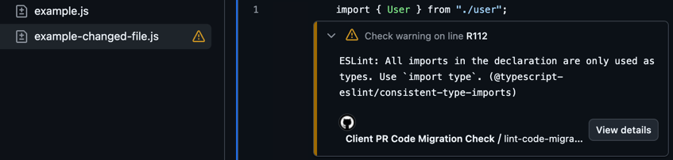

<br>

<h1><span class="the-gradient">Visualising and Enabling</span>Visualising and Enabling Code Migrations at Scale</h1>

<style>
h1 {
    position: relative;
}
.the-gradient {
    background-image: linear-gradient(to right, #a4ffea, white);
    color: transparent;
    background-clip: text;
    position: absolute;
    top: 0;
    left: 0;
    text-shadow: none;
}
</style>

<!--
How we tackle code migrations at scale - moving from legacy patterns to modern ones across large codebases.
-->

---
hideInToc: true
---

# Agenda

<Toc minDepth="1" maxDepth="1" />

---

# Tech Radar

<div class="radar-wrapper">
  <div class="radar">
<div class="ring ring-4"></div>
<div class="ring ring-3"></div>
<div class="ring ring-2"></div>
<div class="ring ring-1"></div>
<div class="crosshair horizontal"></div>
<div class="crosshair vertical"></div>
<div class="center-dot"></div>

<span class="ring-label adopt-label">Adopt</span>
<span class="ring-label trial-label">Trial</span>
<span class="ring-label assess-label">Assess</span>
<span class="ring-label hold-label">HOLD</span>

<div class="blip adopt" style="top: 38%; right: 49%;">
  <span class="blip-dot"></span>
  <span class="blip-label">es-toolkit</span>
</div>
<div class="blip adopt" style="bottom: 38%; right: 48%;">
  <span class="blip-dot"></span>
  <span class="blip-label">date-fns</span>
</div>
<div class="blip trial" style="top: 30%; right: 58%;">
  <span class="blip-dot"></span>
  <span class="blip-label">es-toolkit/compat</span>
</div>
<div class="blip hold" style="top: 18%; right: 70%;">
  <span class="blip-dot"></span>
  <span class="blip-label">Lodash</span>
</div>
<div class="blip hold" style="bottom: 12%; right: 58%;">
  <span class="blip-dot"></span>
  <span class="blip-label">Moment</span>
</div>
<div class="scan-line"></div>
  </div>
</div>

<style>
.radar-wrapper {
  display: flex;
  justify-content: center;
  align-items: center;
  margin-top: 1rem;
}
.radar {
  position: relative;
  width: 420px;
  height: 420px;
  border-radius: 50%;
  background: radial-gradient(circle, rgba(0,50,30,0.8) 0%, rgba(0,20,10,0.95) 70%);
  box-shadow: 0 0 60px rgb(0 130 76 / 10%), inset 0 0 80px rgba(0, 0, 0, 0.1);
  overflow: hidden;
}
.ring {
  position: absolute;
  border-radius: 50%;
  border: 1px solid rgba(0,255,150,0.2);
  top: 50%;
  left: 50%;
  transform: translate(-50%, -50%);
box-shadow: none;
}
.ring-1 { width: 22%; height: 22%; border-color: rgba(74,222,128,0.1); }
.ring-2 { width: 44%; height: 44%; border-color: rgba(250,204,21,0.1); }
.ring-3 { width: 66%; height: 66%; border-color: rgba(251,146,60,0.1); }
.ring-4 { width: 88%; height: 88%; border-color: rgba(239,68,68,0.1); }
.crosshair {
  position: absolute;
  background: rgba(0,255,150,0.1);
}
.crosshair.horizontal {
  width: 100%;
  height: 1px;
  top: 50%;
}
.crosshair.vertical {
  width: 1px;
  height: 100%;
  left: 50%;
}
.center-dot {
  position: absolute;
  width: 8px;
  height: 8px;
  background: #4ade80;
  border-radius: 50%;
  top: 50%;
  left: 50%;
  transform: translate(-50%, -50%);
  box-shadow: 0 0 10px #4ade80;
}
.ring-label {
  position: absolute;
  font-size: 0.55rem;
  text-transform: uppercase;
  letter-spacing: 0.15em;
  top: 45%;
  font-weight: 600;
  opacity: 0.2;
}
.adopt-label { left: 53%; color: #4ade80; }
.trial-label { left: 64%; color: #facc15; }
.assess-label { left: 75%; color: #fb923c; }
.hold-label { left: 86%; color: #ef4444; }
.blip {
  position: absolute;
  display: flex;
  align-items: center;
  gap: 6px;
  z-index: 10;
}
.blip-dot {
  width: 12px;
  height: 12px;
  border-radius: 50%;
  box-shadow: 0 0 8px currentColor;
  flex-shrink: 0;
}
.blip.adopt .blip-dot { background: #4ade80; color: #4ade80; }
.blip.trial .blip-dot { background: #facc15; color: #facc15; }
.blip.assess .blip-dot { background: #fb923c; color: #fb923c; }
.blip.hold .blip-dot { background: #ef4444; color: #ef4444; }
.blip-label {
  font-size: 0.65rem;
  color: rgba(255,255,255,0.9);
  white-space: nowrap;
  text-shadow: 0 1px 3px rgba(0,0,0,0.8);
}
.blip-label.right {
  order: -1;
  text-align: right;
}
.scan-line {
  position: absolute;
  top: 50%;
  left: 50%;
  width: 50%;
  height: 2px;
  background: linear-gradient(90deg, rgba(0,255,150,0.4), transparent);
  transform-origin: left center;
  animation: scan 15s linear infinite;
  box-shadow: 0 0 15px rgba(0,255,150,0.5);
opacity: 0.7;
}
@keyframes scan {
  from { transform: rotate(0deg); }
  to { transform: rotate(360deg); }
}
</style>

<!--
At Accurx we have a tech radar in the frontend guild
to standardise technology choices for new projects.

It defines WHAT to adopt, but not HOW to migrate existing code.

We need a strategy for transitioning legacy codebases.
-->

---
layout: two-cols-header
layoutClass: gap-x-8
---

# Why Code Migration is Hard at Scale

You can't do migrations in one big commit.

::left::

<v-clicks>

- Hard to test
- Huge PR to review
- Git blame becomes useless
- Difficult to revert if something goes wrong
- Lots of merge conflicts

</v-clicks>

<v-click>

<br>

#### One exception: **code formatting**

Can use `.git-blame-ignore-revs` to hide formatting commits

</v-click>

::right::

<div v-click="[2, 3]">

<a href="#" class="tabnav-tab">
<svg aria-hidden="true" height="16" viewBox="0 0 16 16" version="1.1" width="16">
<path d="M1 1.75C1 .784 1.784 0 2.75 0h7.586c.464 0 .909.184 1.237.513l2.914 2.914c.329.328.513.773.513 1.237v9.586A1.75 1.75 0 0 1 13.25 16H2.75A1.75 1.75 0 0 1 1 14.25Zm1.75-.25a.25.25 0 0 0-.25.25v12.5c0 .138.112.25.25.25h10.5a.25.25 0 0 0 .25-.25V4.664a.25.25 0 0 0-.073-.177l-2.914-2.914a.25.25 0 0 0-.177-.073ZM8 3.25a.75.75 0 0 1 .75.75v1.5h1.5a.75.75 0 0 1 0 1.5h-1.5v1.5a.75.75 0 0 1-1.5 0V7h-1.5a.75.75 0 0 1 0-1.5h1.5V4A.75.75 0 0 1 8 3.25Zm-3 8a.75.75 0 0 1 .75-.75h4.5a.75.75 0 0 1 0 1.5h-4.5a.75.75 0 0 1-.75-.75Z"></path>
</svg>
Files changed
 <span id="files_tab_counter" title="5" data-view-component="true" class="Counter">99+</span>
</a>
<span class="diffstat">
<span class="color-fg-success">
+9999
</span>
<span class="color-fg-danger">
−9999
</span>
</span>

<span>
 <span class="diffstat-block-added"></span>
<span class="diffstat-block-added"></span>
<span class="diffstat-block-deleted"></span>
<span class="diffstat-block-deleted"></span>
<span class="diffstat-block-neutral"></span>
</span>

</div>

<div v-click="[3, 4]">

<div class="git-blame">
 <div class="blame-line"><span class="blame-author">Vahid</span><span class="blame-date">2 days ago</span><span class="blame-code">import { type User } from './user'</span></div>
 <div class="blame-line"><span class="blame-author">Vahid</span><span class="blame-date">2 days ago</span><span class="blame-code">import { type Order } from './order'</span></div>
 <div class="blame-line"><span class="blame-author">Vahid</span><span class="blame-date">2 days ago</span><span class="blame-code">import { type Cart } from './cart'</span></div>
</div>

</div>

<style>
.diffstat-block-deleted, .diffstat-block-added, .diffstat-block-neutral {
    display: inline-block;
    width: 0.5rem;
    height: 0.5rem;
    margin-left: 1px;
}
.diffstat-block-added {
    background-color: #3fb950;
}
.diffstat-block-deleted {
    background-color: #f85149;
}
.diffstat-block-neutral {
    background-color: #8b949e;
}
.Counter {
    background-color: #444;
    border-radius: 2em;
    color: #ffffff;
    display: inline-block;
    min-width: 20px;
    padding: 0 4px;
    text-align: center;
}
.tabnav-tab {
    display: inline-flex;
gap: 8px;
    align-items: center;
    font-size: 0.875rem;
    font-weight: 600;
    color: #c9d1d9;
    background-color: #161b22;
    padding: 6px 12px;
    border-radius: 6px;
    border: 1px solid #30363d;
    text-decoration: none;
svg {
color: #8b949e;
fill: #8b949e;
}
}
.diffstat {
  margin-left: 8px;
}
.color-fg-success {
  color: #3fb950;
}
.color-fg-danger {
  color: #f85149;
}
.git-blame {
  margin: 0.5rem 0 0.5rem 1.5rem;
  font-family: 'Fira Code', monospace;
  font-size: 0.6rem;
  background: #161b22;
  border-radius: 6px;
  padding: 0.5rem;
  border: 1px solid #30363d;
}
.blame-line {
  display: flex;
  gap: 1rem;
  padding: 2px 0;
  border-bottom: 1px solid #21262d;
}
.blame-line:last-child {
  border-bottom: none;
}
.blame-author {
  color: #f78166;
  min-width: 20px;
}
.blame-date {
  color: #7d8590;
  min-width: 40px;
}
.blame-code {
  color: #e6edf3;
}
</style>

<!--
Big-bang migrations are tempting but risky.
The only exception is purely cosmetic changes like formatting - git-blame-ignore-revs hides those commits from blame.
But for semantic changes, we need a gradual approach.
-->

---

## Example: TypeScript `verbatimModuleSyntax`

Adding explicit `import type`:

````md magic-move
```ts
// Before: ambiguous imports
import { User, UserService } from "./user";
```

```ts
// After: explicit type imports
import { type User, UserService } from "./user";
```
````

<!--
Simple example: adding explicit type imports for verbatimModuleSyntax.
Thousands of files need this change - can't do it in one PR.
-->

---
layout: two-cols-header
layoutClass: gap-x-8
---

# How a Good Migration Strategy Looks

::left::

<v-clicks depth="2">

1. **Detect legacy patterns**:
   - Regex (grep)
   - Linters
   - ```ts
     function hasLegacy(file): boolean;
     ```
2. **Migrate gradually**:
   - Ideally immediate feedback in IDEs
   - GitHub annotations for PRs
   - Fail CI for new code
3. **Track progress**:
   - Easy to see remaining work
   - Incentivise completion

</v-clicks>

::right::

<div v-click="[6, 7]" class="mt-35">

```ts twoslash
import { User } from "./user";
```

</div>

<div v-click="[7, 8]" class="mt-0">



</div>

<style>
.twoslash .twoslash-hover {
    border-bottom: 1px dashed;
}
</style>

<!--
A good migration strategy:
- identify deprecated code. a function that checks if a file has legacy patterns. it can be a simple script.
- ideally with IDE feedback
- some checks are only possible in CI, use GitHub annotations and fail CI
- track progress to show what's left and motivate engineers
-->

---
layout: two-cols-header
layoutClass: gap-x-8
---

# Our Approach at Accurx

::left::

<v-clicks depth="2">

- ESLint rules
- Custom ESLint rules
- Other tools (Knip for dead code)
- Custom scripts (`find -name` or `grep`)
- Define code areas by domain
- Calculate health scores

</v-clicks>

::right::

<v-click at="1">

````md magic-move {at:2}
```json
{
  "migrations": [
    {
      "file": "domains/conversations/Message.tsx",
      "group": "Eslint: consistent-type-imports",
      "occurrences": 3
    }
  ]
}
```

```json {8-12}
{
  "migrations": [
    {
      "file": "domains/conversations/Message.tsx",
      "group": "Eslint: consistent-type-imports",
      "occurrences": 3
    },
    {
      "file": "domains/user/UserProfile.ts",
      "group": "Eslint: @accurx/no-deprecated-table",
      "occurrences": 1
    }
  ]
}
```

```json {13-16}
{
  "migrations": [
    {
      "file": "domains/conversations/Message.tsx",
      "group": "Eslint: consistent-type-imports",
      "occurrences": 3
    },
    {
      "file": "domains/user/UserProfile.ts",
      "group": "Eslint: @accurx/no-deprecated-table",
      "occurrences": 1
    },
    {
      "file": "domains/triage/Old.tsx",
      "group": "Knip: unused-file"
    }
  ]
}
```

```json {17-20}
{
  "migrations": [
    {
      "file": "domains/conversations/Message.tsx",
      "group": "Eslint: consistent-type-imports",
      "occurrences": 3
    },
    {
      "file": "domains/user/UserProfile.ts",
      "group": "Eslint: @accurx/no-deprecated-table",
      "occurrences": 1
    },
    {
      "file": "domains/triage/Old.tsx",
      "group": "Knip: unused-file"
    },
    {
      "file": "domains/scribe/legacy.test.tsx",
      "group": "Script: migrate-to-vitest"
    }
  ]
}
```

```json {2-8|6}
{
  "areas": [
    {
      "name": "Conversation",
      "paths": ["domains/conversation/**/*"],
      "healthScore": 90.5
    }
  ],
  "migrations": [
    {
      "file": "domains/conversations/Message.tsx",
      "group": "Eslint: consistent-type-imports",
      "occurrences": 3
    },
    {
      "file": "domains/user/UserProfile.ts",
      "group": "Eslint: @accurx/no-deprecated-table",
      "occurrences": 1
    },
    {
      "file": "domains/triage/Old.tsx",
      "group": "Knip: unused-file"
    },
    {
      "file": "domains/scribe/legacy.test.tsx",
      "group": "Script: migrate-to-vitest"
    }
  ]
}
```
````

</v-click>

<!--
We track multiple migrations in Accurx.
- We use ESLint rules for common patterns.
- Create custom ESLint rules for project-specific patterns.
- Any other tools such as Knip for unused code.
- Or even custom scripts such as file name patterns.
- We aggregate results into a JSON report.
- We define code areas by domain and calculate health scores.
-->

---

# Visualise in a Dashboard

We use Grafana to visualise migration progress.

<v-switch>
<template #1>

**Track each migration's progress**

<div class="heatmap">
  <div class="heatmap-row">
    <span class="heatmap-label">Eslint: @accurx/no-deprecated-text</span>
    <span class="heatmap-cells">
<i style=" background-image: radial-gradient( rgba(115, 191, 105, 0.95) 10%, rgba(115, 191, 105, 0.55) ); " /> <i style=" background-image: radial-gradient( rgba(122, 193, 102, 0.95) 10%, rgba(122, 193, 102, 0.55) ); " /> <i style=" background-image: radial-gradient( rgba(129, 194, 98, 0.95) 10%, rgba(129, 194, 98, 0.55) ); " /> <i style=" background-image: radial-gradient( rgba(136, 196, 95, 0.95) 10%, rgba(136, 196, 95, 0.55) ); " /> <i style=" background-image: radial-gradient( rgba(143, 197, 92, 0.95) 10%, rgba(143, 197, 92, 0.55) ); " /> <i style=" background-image: radial-gradient( rgba(150, 199, 89, 0.95) 10%, rgba(150, 199, 89, 0.55) ); " /> <i style=" background-image: radial-gradient( rgba(157, 200, 86, 0.95) 10%, rgba(157, 200, 86, 0.55) ); " /> <i style=" background-image: radial-gradient( rgba(164, 201, 83, 0.95) 10%, rgba(164, 201, 83, 0.55) ); " /> <i style=" background-image: radial-gradient( rgba(170, 202, 80, 0.95) 10%, rgba(170, 202, 80, 0.55) ); " /> <i style=" background-image: radial-gradient( rgba(176, 202, 77, 0.95) 10%, rgba(176, 202, 77, 0.55) ); " /> <i style=" background-image: radial-gradient( rgba(183, 203, 75, 0.95) 10%, rgba(183, 203, 75, 0.55) ); " /> <i style=" background-image: radial-gradient( rgba(189, 203, 72, 0.95) 10%, rgba(189, 203, 72, 0.55) ); " /> <i style=" background-image: radial-gradient( rgba(194, 203, 70, 0.95) 10%, rgba(194, 203, 70, 0.55) ); " /> <i style=" background-image: radial-gradient( rgba(200, 203, 68, 0.95) 10%, rgba(200, 203, 68, 0.55) ); " /> <i style=" background-image: radial-gradient( rgba(205, 202, 66, 0.95) 10%, rgba(205, 202, 66, 0.55) ); " /> <i style=" background-image: radial-gradient( rgba(210, 201, 65, 0.95) 10%, rgba(210, 201, 65, 0.55) ); " /> <i style=" background-image: radial-gradient( rgba(214, 199, 63, 0.95) 10%, rgba(214, 199, 63, 0.55) ); " /> <i style=" background-image: radial-gradient( rgba(219, 197, 62, 0.95) 10%, rgba(219, 197, 62, 0.55) ); " /> <i style=" background-image: radial-gradient( rgba(223, 195, 61, 0.95) 10%, rgba(223, 195, 61, 0.55) ); " /> <i style=" background-image: radial-gradient( rgba(226, 192, 61, 0.95) 10%, rgba(226, 192, 61, 0.55) ); " /> <i style=" background-image: radial-gradient( rgba(229, 189, 61, 0.95) 10%, rgba(229, 189, 61, 0.55) ); " /> <i style=" background-image: radial-gradient( rgba(232, 185, 61, 0.95) 10%, rgba(232, 185, 61, 0.55) ); " /> <i style=" background-image: radial-gradient( rgba(235, 181, 61, 0.95) 10%, rgba(235, 181, 61, 0.55) ); " /> <i style=" background-image: radial-gradient( rgba(237, 176, 62, 0.95) 10%, rgba(237, 176, 62, 0.55) ); " /> <i style=" background-image: radial-gradient( rgba(238, 171, 63, 0.95) 10%, rgba(238, 171, 63, 0.55) ); " /> <i style=" background-image: radial-gradient( rgba(240, 165, 64, 0.95) 10%, rgba(240, 165, 64, 0.55) ); " /> <i style=" background-image: radial-gradient( rgba(241, 160, 65, 0.95) 10%, rgba(241, 160, 65, 0.55) ); " /> <i style=" background-image: radial-gradient( rgba(242, 153, 67, 0.95) 10%, rgba(242, 153, 67, 0.55) ); " /> <i style=" background-image: radial-gradient( rgba(243, 147, 68, 0.95) 10%, rgba(243, 147, 68, 0.55) ); " /> <i style=" background-image: radial-gradient( rgba(244, 133, 72, 0.95) 10%, rgba(244, 133, 72, 0.55) ); " /> <i style=" background-image: radial-gradient( rgba(244, 126, 75, 0.95) 10%, rgba(244, 126, 75, 0.55) ); " /> <i style=" background-image: radial-gradient( rgba(244, 112, 79, 0.95) 10%, rgba(244, 112, 79, 0.55) ); " /> <i style=" background-image: radial-gradient( rgba(243, 104, 82, 0.95) 10%, rgba(243, 104, 82, 0.55) ); " /> <i style=" background-image: radial-gradient( rgba(243, 96, 84, 0.95) 10%, rgba(243, 96, 84, 0.55) ); " /> <i style=" background-image: radial-gradient( rgba(243, 89, 87, 0.95) 10%, rgba(243, 89, 87, 0.55) ); " /> <i style=" background-image: radial-gradient( rgba(242, 77, 91, 0.95) 10%, rgba(242, 77, 91, 0.55) ); " />
    </span>
    <span class="heatmap-count" style="color:#f85149">90</span>
  </div>
  <div class="heatmap-row">
    <span class="heatmap-label">Eslint: @accurx/no-bootstrap-utilities</span>
    <span class="heatmap-cells">
<i style=" background-image: radial-gradient( rgba(115, 191, 105, 0.95) 10%, rgba(115, 191, 105, 0.55) ); " /> <i style=" background-image: radial-gradient( rgba(122, 193, 102, 0.95) 10%, rgba(122, 193, 102, 0.55) ); " /> <i style=" background-image: radial-gradient( rgba(129, 194, 98, 0.95) 10%, rgba(129, 194, 98, 0.55) ); " /> <i style=" background-image: radial-gradient( rgba(136, 196, 95, 0.95) 10%, rgba(136, 196, 95, 0.55) ); " /> <i style=" background-image: radial-gradient( rgba(143, 197, 92, 0.95) 10%, rgba(143, 197, 92, 0.55) ); " /> <i style=" background-image: radial-gradient( rgba(150, 199, 89, 0.95) 10%, rgba(150, 199, 89, 0.55) ); " /> <i style=" background-image: radial-gradient( rgba(157, 200, 86, 0.95) 10%, rgba(157, 200, 86, 0.55) ); " /> <i style=" background-image: radial-gradient( rgba(164, 201, 83, 0.95) 10%, rgba(164, 201, 83, 0.55) ); " /> <i style=" background-image: radial-gradient( rgba(170, 202, 80, 0.95) 10%, rgba(170, 202, 80, 0.55) ); " /> <i style=" background-image: radial-gradient( rgba(176, 202, 77, 0.95) 10%, rgba(176, 202, 77, 0.55) ); " /> <i style=" background-image: radial-gradient( rgba(183, 203, 75, 0.95) 10%, rgba(183, 203, 75, 0.55) ); " /> <i style=" background-image: radial-gradient( rgba(189, 203, 72, 0.95) 10%, rgba(189, 203, 72, 0.55) ); " /> <i style=" background-image: radial-gradient( rgba(194, 203, 70, 0.95) 10%, rgba(194, 203, 70, 0.55) ); " /> <i style=" background-image: radial-gradient( rgba(200, 203, 68, 0.95) 10%, rgba(200, 203, 68, 0.55) ); " /> <i style=" background-image: radial-gradient( rgba(205, 202, 66, 0.95) 10%, rgba(205, 202, 66, 0.55) ); " /> <i style=" background-image: radial-gradient( rgba(210, 201, 65, 0.95) 10%, rgba(210, 201, 65, 0.55) ); " /> <i style=" background-image: radial-gradient( rgba(214, 199, 63, 0.95) 10%, rgba(214, 199, 63, 0.55) ); " /> <i style=" background-image: radial-gradient( rgba(219, 197, 62, 0.95) 10%, rgba(219, 197, 62, 0.55) ); " /> <i style=" background-image: radial-gradient( rgba(223, 195, 61, 0.95) 10%, rgba(223, 195, 61, 0.55) ); " /> <i style=" background-image: radial-gradient( rgba(226, 192, 61, 0.95) 10%, rgba(226, 192, 61, 0.55) ); " /> <i style=" background-image: radial-gradient( rgba(229, 189, 61, 0.95) 10%, rgba(229, 189, 61, 0.55) ); " /> <i style=" background-image: radial-gradient( rgba(232, 185, 61, 0.95) 10%, rgba(232, 185, 61, 0.55) ); " /> <i style=" background-image: radial-gradient( rgba(235, 181, 61, 0.95) 10%, rgba(235, 181, 61, 0.55) ); " /> <i style=" background-image: radial-gradient( rgba(237, 176, 62, 0.95) 10%, rgba(237, 176, 62, 0.55) ); " /> <i style=" background-image: radial-gradient( rgba(238, 171, 63, 0.95) 10%, rgba(238, 171, 63, 0.55) ); " /> <i style=" background-image: radial-gradient( rgba(240, 165, 64, 0.95) 10%, rgba(240, 165, 64, 0.55) ); " /> <i style=" background-image: radial-gradient( rgba(241, 160, 65, 0.95) 10%, rgba(241, 160, 65, 0.55) ); " /> <i style=" background-image: radial-gradient( rgba(242, 153, 67, 0.95) 10%, rgba(242, 153, 67, 0.55) ); " /> <i style=" background-image: radial-gradient( rgba(243, 147, 68, 0.95) 10%, rgba(243, 147, 68, 0.55) ); " /> <i style=" background-image: radial-gradient( rgba(244, 133, 72, 0.95) 10%, rgba(244, 133, 72, 0.55) ); " /> <i style=" background-image: radial-gradient( rgba(244, 126, 75, 0.95) 10%, rgba(244, 126, 75, 0.55) ); " /> <i style=" background-image: radial-gradient( rgba(244, 112, 79, 0.95) 10%, rgba(244, 112, 79, 0.55) ); " /> <i style=" background-image: radial-gradient( rgba(243, 104, 82, 0.95) 10%, rgba(243, 104, 82, 0.55) ); " /> <i style=" background-image: radial-gradient( rgba(243, 96, 84, 0.95) 10%, rgba(243, 96, 84, 0.55) ); " /> <i style=" background-image: radial-gradient( rgba(243, 89, 87, 0.95) 10%, rgba(243, 89, 87, 0.55) ); " /> <i style=" background-image: radial-gradient( rgba(242, 77, 91, 0.95) 10%, rgba(242, 77, 91, 0.55) ); " />
    </span>
    <span class="heatmap-count" style="color:#d4a72c">32</span>
  </div>
  <div class="heatmap-row">
    <span class="heatmap-label">Eslint: consistent-type-imports</span>
    <span class="heatmap-cells">
<i style=" background-image: radial-gradient( rgba(115, 191, 105, 0.95) 10%, rgba(115, 191, 105, 0.55) ); " /> <i style=" background-image: radial-gradient( rgba(122, 193, 102, 0.95) 10%, rgba(122, 193, 102, 0.55) ); " /> <i style=" background-image: radial-gradient( rgba(129, 194, 98, 0.95) 10%, rgba(129, 194, 98, 0.55) ); " /> <i style=" background-image: radial-gradient( rgba(136, 196, 95, 0.95) 10%, rgba(136, 196, 95, 0.55) ); " /> <i style=" background-image: radial-gradient( rgba(143, 197, 92, 0.95) 10%, rgba(143, 197, 92, 0.55) ); " /> <i style=" background-image: radial-gradient( rgba(150, 199, 89, 0.95) 10%, rgba(150, 199, 89, 0.55) ); " /> <i style=" background-image: radial-gradient( rgba(157, 200, 86, 0.95) 10%, rgba(157, 200, 86, 0.55) ); " /> <i style=" background-image: radial-gradient( rgba(164, 201, 83, 0.95) 10%, rgba(164, 201, 83, 0.55) ); " /> <i style=" background-image: radial-gradient( rgba(170, 202, 80, 0.95) 10%, rgba(170, 202, 80, 0.55) ); " /> <i style=" background-image: radial-gradient( rgba(176, 202, 77, 0.95) 10%, rgba(176, 202, 77, 0.55) ); " /> <i style=" background-image: radial-gradient( rgba(183, 203, 75, 0.95) 10%, rgba(183, 203, 75, 0.55) ); " /> <i style=" background-image: radial-gradient( rgba(189, 203, 72, 0.95) 10%, rgba(189, 203, 72, 0.55) ); " /> <i style=" background-image: radial-gradient( rgba(194, 203, 70, 0.95) 10%, rgba(194, 203, 70, 0.55) ); " /> <i style=" background-image: radial-gradient( rgba(200, 203, 68, 0.95) 10%, rgba(200, 203, 68, 0.55) ); " /> <i style=" background-image: radial-gradient( rgba(205, 202, 66, 0.95) 10%, rgba(205, 202, 66, 0.55) ); " /> <i style=" background-image: radial-gradient( rgba(210, 201, 65, 0.95) 10%, rgba(210, 201, 65, 0.55) ); " /> <i style=" background-image: radial-gradient( rgba(214, 199, 63, 0.95) 10%, rgba(214, 199, 63, 0.55) ); " /> <i style=" background-image: radial-gradient( rgba(219, 197, 62, 0.95) 10%, rgba(219, 197, 62, 0.55) ); " /> <i style=" background-image: radial-gradient( rgba(223, 195, 61, 0.95) 10%, rgba(223, 195, 61, 0.55) ); " /> <i style=" background-image: radial-gradient( rgba(226, 192, 61, 0.95) 10%, rgba(226, 192, 61, 0.55) ); " /> <i style=" background-image: radial-gradient( rgba(229, 189, 61, 0.95) 10%, rgba(229, 189, 61, 0.55) ); " /> <i style=" background-image: radial-gradient( rgba(232, 185, 61, 0.95) 10%, rgba(232, 185, 61, 0.55) ); " /> <i style=" background-image: radial-gradient( rgba(235, 181, 61, 0.95) 10%, rgba(235, 181, 61, 0.55) ); " /> <i style=" background-image: radial-gradient( rgba(237, 176, 62, 0.95) 10%, rgba(237, 176, 62, 0.55) ); " /> <i style=" background-image: radial-gradient( rgba(238, 171, 63, 0.95) 10%, rgba(238, 171, 63, 0.55) ); " /> <i style=" background-image: radial-gradient( rgba(240, 165, 64, 0.95) 10%, rgba(240, 165, 64, 0.55) ); " /> <i style=" background-image: radial-gradient( rgba(241, 160, 65, 0.95) 10%, rgba(241, 160, 65, 0.55) ); " /> <i style=" background-image: radial-gradient( rgba(242, 153, 67, 0.95) 10%, rgba(242, 153, 67, 0.55) ); " /> <i style=" background-image: radial-gradient( rgba(243, 147, 68, 0.95) 10%, rgba(243, 147, 68, 0.55) ); " /> <i style=" background-image: radial-gradient( rgba(244, 133, 72, 0.95) 10%, rgba(244, 133, 72, 0.55) ); " /> <i style=" background-image: radial-gradient( rgba(244, 126, 75, 0.95) 10%, rgba(244, 126, 75, 0.55) ); " /> <i style=" background-image: radial-gradient( rgba(244, 112, 79, 0.95) 10%, rgba(244, 112, 79, 0.55) ); " /> <i style=" background-image: radial-gradient( rgba(243, 104, 82, 0.95) 10%, rgba(243, 104, 82, 0.55) ); " /> <i style=" background-image: radial-gradient( rgba(243, 96, 84, 0.95) 10%, rgba(243, 96, 84, 0.55) ); " /> <i style=" background-image: radial-gradient( rgba(243, 89, 87, 0.95) 10%, rgba(243, 89, 87, 0.55) ); " /> <i style=" background-image: radial-gradient( rgba(242, 77, 91, 0.95) 10%, rgba(242, 77, 91, 0.55) ); " />
    </span>
    <span class="heatmap-count" style="color:#7cb342">19</span>
  </div>
  <div class="heatmap-row">
    <span class="heatmap-label">Knip: unused-file</span>
    <span class="heatmap-cells">
<i style=" background-image: radial-gradient( rgba(115, 191, 105, 0.95) 10%, rgba(115, 191, 105, 0.55) ); " /> <i style=" background-image: radial-gradient( rgba(122, 193, 102, 0.95) 10%, rgba(122, 193, 102, 0.55) ); " /> <i style=" background-image: radial-gradient( rgba(129, 194, 98, 0.95) 10%, rgba(129, 194, 98, 0.55) ); " /> <i style=" background-image: radial-gradient( rgba(136, 196, 95, 0.95) 10%, rgba(136, 196, 95, 0.55) ); " /> <i style=" background-image: radial-gradient( rgba(143, 197, 92, 0.95) 10%, rgba(143, 197, 92, 0.55) ); " /> <i style=" background-image: radial-gradient( rgba(150, 199, 89, 0.95) 10%, rgba(150, 199, 89, 0.55) ); " /> <i style=" background-image: radial-gradient( rgba(157, 200, 86, 0.95) 10%, rgba(157, 200, 86, 0.55) ); " /> <i style=" background-image: radial-gradient( rgba(164, 201, 83, 0.95) 10%, rgba(164, 201, 83, 0.55) ); " /> <i style=" background-image: radial-gradient( rgba(170, 202, 80, 0.95) 10%, rgba(170, 202, 80, 0.55) ); " /> <i style=" background-image: radial-gradient( rgba(176, 202, 77, 0.95) 10%, rgba(176, 202, 77, 0.55) ); " /> <i style=" background-image: radial-gradient( rgba(183, 203, 75, 0.95) 10%, rgba(183, 203, 75, 0.55) ); " /> <i style=" background-image: radial-gradient( rgba(189, 203, 72, 0.95) 10%, rgba(189, 203, 72, 0.55) ); " /> <i style=" background-image: radial-gradient( rgba(194, 203, 70, 0.95) 10%, rgba(194, 203, 70, 0.55) ); " /> <i style=" background-image: radial-gradient( rgba(200, 203, 68, 0.95) 10%, rgba(200, 203, 68, 0.55) ); " /> <i style=" background-image: radial-gradient( rgba(205, 202, 66, 0.95) 10%, rgba(205, 202, 66, 0.55) ); " /> <i style=" background-image: radial-gradient( rgba(210, 201, 65, 0.95) 10%, rgba(210, 201, 65, 0.55) ); " /> <i style=" background-image: radial-gradient( rgba(214, 199, 63, 0.95) 10%, rgba(214, 199, 63, 0.55) ); " /> <i style=" background-image: radial-gradient( rgba(219, 197, 62, 0.95) 10%, rgba(219, 197, 62, 0.55) ); " /> <i style=" background-image: radial-gradient( rgba(223, 195, 61, 0.95) 10%, rgba(223, 195, 61, 0.55) ); " /> <i style=" background-image: radial-gradient( rgba(226, 192, 61, 0.95) 10%, rgba(226, 192, 61, 0.55) ); " /> <i style=" background-image: radial-gradient( rgba(229, 189, 61, 0.95) 10%, rgba(229, 189, 61, 0.55) ); " /> <i style=" background-image: radial-gradient( rgba(232, 185, 61, 0.95) 10%, rgba(232, 185, 61, 0.55) ); " /> <i style=" background-image: radial-gradient( rgba(235, 181, 61, 0.95) 10%, rgba(235, 181, 61, 0.55) ); " /> <i style=" background-image: radial-gradient( rgba(237, 176, 62, 0.95) 10%, rgba(237, 176, 62, 0.55) ); " /> <i style=" background-image: radial-gradient( rgba(238, 171, 63, 0.95) 10%, rgba(238, 171, 63, 0.55) ); " /> <i style=" background-image: radial-gradient( rgba(240, 165, 64, 0.95) 10%, rgba(240, 165, 64, 0.55) ); " /> <i style=" background-image: radial-gradient( rgba(241, 160, 65, 0.95) 10%, rgba(241, 160, 65, 0.55) ); " /> <i style=" background-image: radial-gradient( rgba(242, 153, 67, 0.95) 10%, rgba(242, 153, 67, 0.55) ); " /> <i style=" background-image: radial-gradient( rgba(243, 147, 68, 0.95) 10%, rgba(243, 147, 68, 0.55) ); " /> <i style=" background-image: radial-gradient( rgba(244, 133, 72, 0.95) 10%, rgba(244, 133, 72, 0.55) ); " /> <i style=" background-image: radial-gradient( rgba(244, 126, 75, 0.95) 10%, rgba(244, 126, 75, 0.55) ); " /> <i style=" background-image: radial-gradient( rgba(244, 112, 79, 0.95) 10%, rgba(244, 112, 79, 0.55) ); " /> <i style=" background-image: radial-gradient( rgba(243, 104, 82, 0.95) 10%, rgba(243, 104, 82, 0.55) ); " /> <i style=" background-image: radial-gradient( rgba(243, 96, 84, 0.95) 10%, rgba(243, 96, 84, 0.55) ); " /> <i style=" background-image: radial-gradient( rgba(243, 89, 87, 0.95) 10%, rgba(243, 89, 87, 0.55) ); " /> <i style=" background-image: radial-gradient( rgba(242, 77, 91, 0.95) 10%, rgba(242, 77, 91, 0.55) ); " />
    </span>
    <span class="heatmap-count" style="color:#7cb342">15</span>
  </div>
  <div class="heatmap-row">
    <span class="heatmap-label">Script: migrate-to-vitest</span>
    <span class="heatmap-cells">
<i style=" background-image: radial-gradient( rgba(115, 191, 105, 0.95) 10%, rgba(115, 191, 105, 0.55) ); " /> <i style=" background-image: radial-gradient( rgba(122, 193, 102, 0.95) 10%, rgba(122, 193, 102, 0.55) ); " /> <i style=" background-image: radial-gradient( rgba(129, 194, 98, 0.95) 10%, rgba(129, 194, 98, 0.55) ); " /> <i style=" background-image: radial-gradient( rgba(136, 196, 95, 0.95) 10%, rgba(136, 196, 95, 0.55) ); " /> <i style=" background-image: radial-gradient( rgba(143, 197, 92, 0.95) 10%, rgba(143, 197, 92, 0.55) ); " /> <i style=" background-image: radial-gradient( rgba(150, 199, 89, 0.95) 10%, rgba(150, 199, 89, 0.55) ); " /> <i style=" background-image: radial-gradient( rgba(157, 200, 86, 0.95) 10%, rgba(157, 200, 86, 0.55) ); " /> <i style=" background-image: radial-gradient( rgba(164, 201, 83, 0.95) 10%, rgba(164, 201, 83, 0.55) ); " /> <i style=" background-image: radial-gradient( rgba(170, 202, 80, 0.95) 10%, rgba(170, 202, 80, 0.55) ); " /> <i style=" background-image: radial-gradient( rgba(176, 202, 77, 0.95) 10%, rgba(176, 202, 77, 0.55) ); " /> <i style=" background-image: radial-gradient( rgba(183, 203, 75, 0.95) 10%, rgba(183, 203, 75, 0.55) ); " /> <i style=" background-image: radial-gradient( rgba(189, 203, 72, 0.95) 10%, rgba(189, 203, 72, 0.55) ); " /> <i style=" background-image: radial-gradient( rgba(194, 203, 70, 0.95) 10%, rgba(194, 203, 70, 0.55) ); " /> <i style=" background-image: radial-gradient( rgba(200, 203, 68, 0.95) 10%, rgba(200, 203, 68, 0.55) ); " /> <i style=" background-image: radial-gradient( rgba(205, 202, 66, 0.95) 10%, rgba(205, 202, 66, 0.55) ); " /> <i style=" background-image: radial-gradient( rgba(210, 201, 65, 0.95) 10%, rgba(210, 201, 65, 0.55) ); " /> <i style=" background-image: radial-gradient( rgba(214, 199, 63, 0.95) 10%, rgba(214, 199, 63, 0.55) ); " /> <i style=" background-image: radial-gradient( rgba(219, 197, 62, 0.95) 10%, rgba(219, 197, 62, 0.55) ); " /> <i style=" background-image: radial-gradient( rgba(223, 195, 61, 0.95) 10%, rgba(223, 195, 61, 0.55) ); " /> <i style=" background-image: radial-gradient( rgba(226, 192, 61, 0.95) 10%, rgba(226, 192, 61, 0.55) ); " /> <i style=" background-image: radial-gradient( rgba(229, 189, 61, 0.95) 10%, rgba(229, 189, 61, 0.55) ); " /> <i style=" background-image: radial-gradient( rgba(232, 185, 61, 0.95) 10%, rgba(232, 185, 61, 0.55) ); " /> <i style=" background-image: radial-gradient( rgba(235, 181, 61, 0.95) 10%, rgba(235, 181, 61, 0.55) ); " /> <i style=" background-image: radial-gradient( rgba(237, 176, 62, 0.95) 10%, rgba(237, 176, 62, 0.55) ); " /> <i style=" background-image: radial-gradient( rgba(238, 171, 63, 0.95) 10%, rgba(238, 171, 63, 0.55) ); " /> <i style=" background-image: radial-gradient( rgba(240, 165, 64, 0.95) 10%, rgba(240, 165, 64, 0.55) ); " /> <i style=" background-image: radial-gradient( rgba(241, 160, 65, 0.95) 10%, rgba(241, 160, 65, 0.55) ); " /> <i style=" background-image: radial-gradient( rgba(242, 153, 67, 0.95) 10%, rgba(242, 153, 67, 0.55) ); " /> <i style=" background-image: radial-gradient( rgba(243, 147, 68, 0.95) 10%, rgba(243, 147, 68, 0.55) ); " /> <i style=" background-image: radial-gradient( rgba(244, 133, 72, 0.95) 10%, rgba(244, 133, 72, 0.55) ); " /> <i style=" background-image: radial-gradient( rgba(244, 126, 75, 0.95) 10%, rgba(244, 126, 75, 0.55) ); " /> <i style=" background-image: radial-gradient( rgba(244, 112, 79, 0.95) 10%, rgba(244, 112, 79, 0.55) ); " /> <i style=" background-image: radial-gradient( rgba(243, 104, 82, 0.95) 10%, rgba(243, 104, 82, 0.55) ); " /> <i style=" background-image: radial-gradient( rgba(243, 96, 84, 0.95) 10%, rgba(243, 96, 84, 0.55) ); " /> <i style=" background-image: radial-gradient( rgba(243, 89, 87, 0.95) 10%, rgba(243, 89, 87, 0.55) ); " /> <i style=" background-image: radial-gradient( rgba(242, 77, 91, 0.95) 10%, rgba(242, 77, 91, 0.55) ); " />
    </span>
    <span class="heatmap-count" style="color:#3fb950">14</span>
  </div>
</div>

</template>
<template #2>

**Overall health score across domains**

<div class="gauges">
  <div class="gauge">
    <svg viewBox="0 0 100 60" class="gauge-svg">
      <path class="gauge-bg" d="M10,50 A40,40 0 1,1 90,50" />
      <path class="gauge-fill orange" d="M10,50 A40,40 0 1,1 90,50" style="stroke-dasharray: 70.2, 125.6" />
    </svg>
    <div class="gauge-value orange">64.2%</div>
    <div class="gauge-label">Scribe</div>
  </div>
  <div class="gauge">
    <svg viewBox="0 0 100 60" class="gauge-svg">
      <path class="gauge-bg" d="M10,50 A40,40 0 1,1 90,50" />
      <path class="gauge-fill yellow" d="M10,50 A40,40 0 1,1 90,50" style="stroke-dasharray: 86.5, 125.6" />
    </svg>
    <div class="gauge-value yellow">76.5%</div>
    <div class="gauge-label">Conversation</div>
  </div>
  <div class="gauge">
    <svg viewBox="0 0 100 60" class="gauge-svg">
      <path class="gauge-bg" d="M10,50 A40,40 0 1,1 90,50" />
      <path class="gauge-fill green" d="M10,50 A40,40 0 1,1 90,50" style="stroke-dasharray: 108.8, 125.6" />
    </svg>
    <div class="gauge-value green">88.8%</div>
    <div class="gauge-label">Patient</div>
  </div>
</div>

</template>

<template #3>

**Files needing migration**

<div class="dashboard-table">
  <div class="table-header">Files grouped by domain</div>
  <div class="area-row collapsed">
    <span class="chevron">+</span>
    <span class="area-name">Conversation</span>
  </div>
  <div class="area-row collapsed">
    <span class="chevron">+</span>
    <span class="area-name">User</span>
  </div>
  <div class="area-row expanded">
    <span class="chevron">-</span>
    <span class="area-name">Triage</span>
  </div>
  <div class="files-table">
    <div class="files-header">
      <span class="col-file">file</span>
      <span class="col-group">group</span>
      <span class="col-count">occurrences</span>
    </div>
    <div class="file-row">
      <span class="col-file">src/domains/triage/components/TriageList.tsx</span>
      <span class="col-group">Eslint: consistent-type-imports</span>
      <span class="col-count">3</span>
    </div>
    <div class="file-row">
      <span class="col-file">src/domains/triage/Old.tsx</span>
      <span class="col-group">Knip: unused-file</span>
      <span class="col-count">1</span>
    </div>
    <div class="file-row">
      <span class="col-file">src/domains/triage/legacy.test.tsx</span>
      <span class="col-group">Script: migrate-to-vitest</span>
      <span class="col-count">1</span>
    </div>
  </div>
</div>

</template>

</v-switch>

<style>
.dashboard-table {
  background: #0d1117;
  border: 1px solid #30363d;
  border-radius: 6px;
  /*font-size: 0.7rem;*/
  overflow: hidden;
}
.table-header {
  padding: 0.75rem 1rem;
  color: #e6edf3;
  border-bottom: 1px solid #30363d;
}
.area-row {
  display: flex;
  align-items: center;
  gap: 0.5rem;
  padding: 0.5rem 1rem;
  border-bottom: 1px solid #21262d;
  color: #e6edf3;
}
.chevron {
  color: #7d8590;
  width: 1rem;
}
.area-name {
  font-weight: 500;
}
.files-table {
  background: #161b22;
  margin-left: 1.5rem;
}
.files-header {
  display: flex;
  padding: 0.4rem 1rem;
  color: #7d8590;
  border-bottom: 1px solid #30363d;
}
.file-row {
  display: flex;
  padding: 0.4rem 1rem;
  border-bottom: 1px solid #21262d;
  color: #e6edf3;
}
.col-file { flex: 2; }
.col-group { flex: 1.5; color: #7d8590; }
.col-count { flex: 0.3; text-align: right; }

/* Heatmap styles */
.heatmap {
  background: #0d1117;
  border-radius: 6px;
  padding: 0.75rem;
}
.heatmap-row {
  display: flex;
  align-items: center;
  gap: 0.75rem;
  padding: 0.1rem 0;
}
.heatmap-label {
  color: #e6edf3;
  min-width: 320px;
  text-align: left;
}
.heatmap-cells {
  display: flex;
  gap: 2px;
}
.heatmap-cells > i {
  display: inline-block;
  width: 11px;
  height: 16px;
  border-radius: 2px;
}
.heatmap-row:nth-child(2) > .heatmap-cells > i:nth-child(n + 25),
.heatmap-row:nth-child(3) > .heatmap-cells > i:nth-child(n + 16),
.heatmap-row:nth-child(4) > .heatmap-cells > i:nth-child(n + 12),
.heatmap-row:nth-child(5) > .heatmap-cells > i:nth-child(n + 10) {
  opacity: 0.3;
}
.heatmap-count {
  font-family: "Fira Code", monospace;
  min-width: 30px;
  text-align: right;
}

/* Gauge styles */
.gauges {
  display: flex;
  justify-content: center;
  gap: 2rem;
  padding: 1rem;
}
.gauge {
  text-align: center;
  width: 250px;
}
.gauge-svg {
  width: 250px;
  height: 150px;

}
.gauge-bg {
  fill: none;
  stroke: #21262d;
  stroke-width: 8;
  stroke-linecap: round;
}
.gauge-fill {
  fill: none;
  stroke-width: 8;
  stroke-linecap: round;
}
.gauge-fill.orange { stroke: #db6d28; }
.gauge-fill.yellow { stroke: #d4a72c; }
.gauge-fill.green { stroke: #3fb950; }
.gauge-value {
  font-size: 2rem;
  font-weight: 700;
  margin-top: -3.5rem;
}
.gauge-value.orange { color: #db6d28; }
.gauge-value.yellow { color: #d4a72c; }
.gauge-value.green { color: #3fb950; }
.gauge-label {
  color: #7d8590;
  margin-top: 0.25rem;
}
</style>

<!--
It's always nice to have a visual representation so teams can see their progress.
-->

---

# Summary

- Detect deprecated patterns
- Show in IDE and PRs
- Fail CI only for changed files in PRs
- Track progress over time
- Domain-specific health scores
- Visualise with charts
