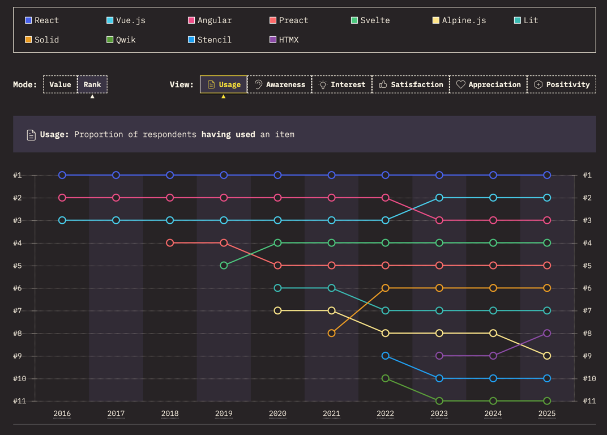
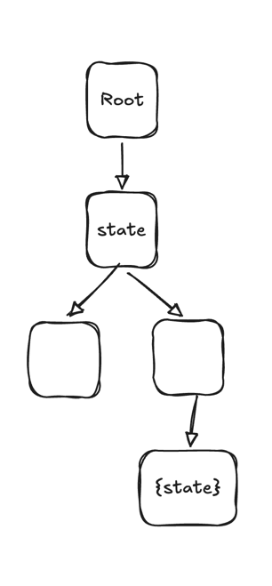
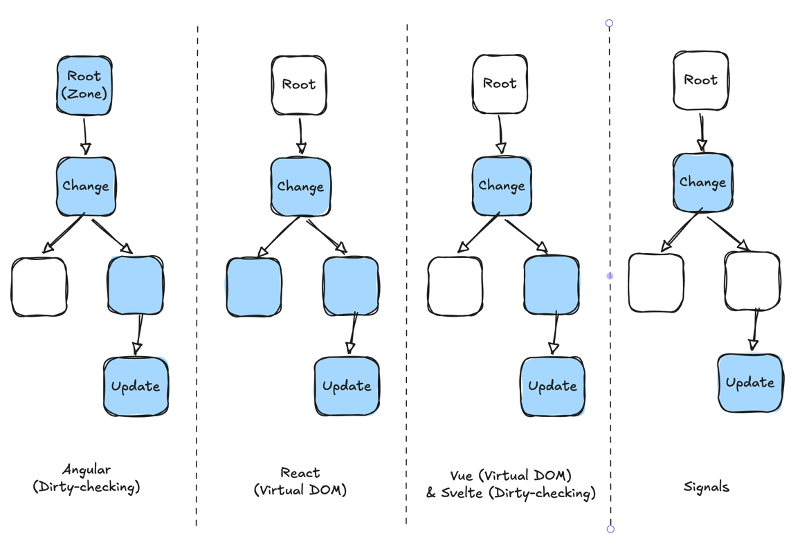
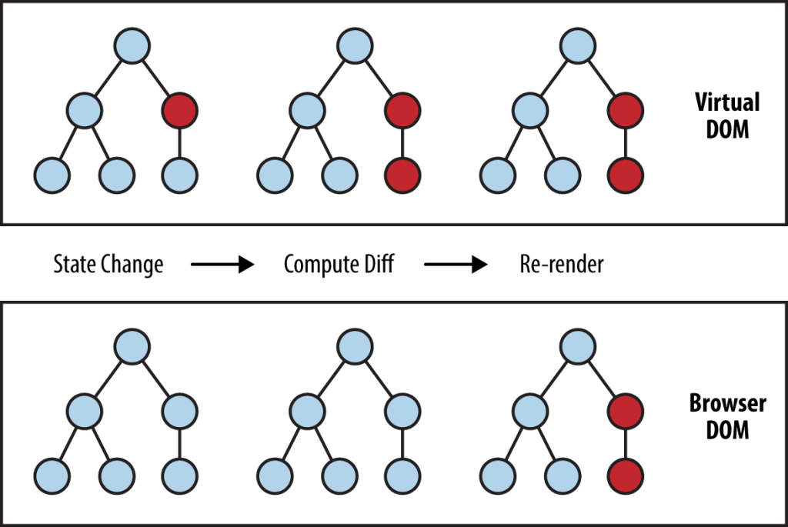
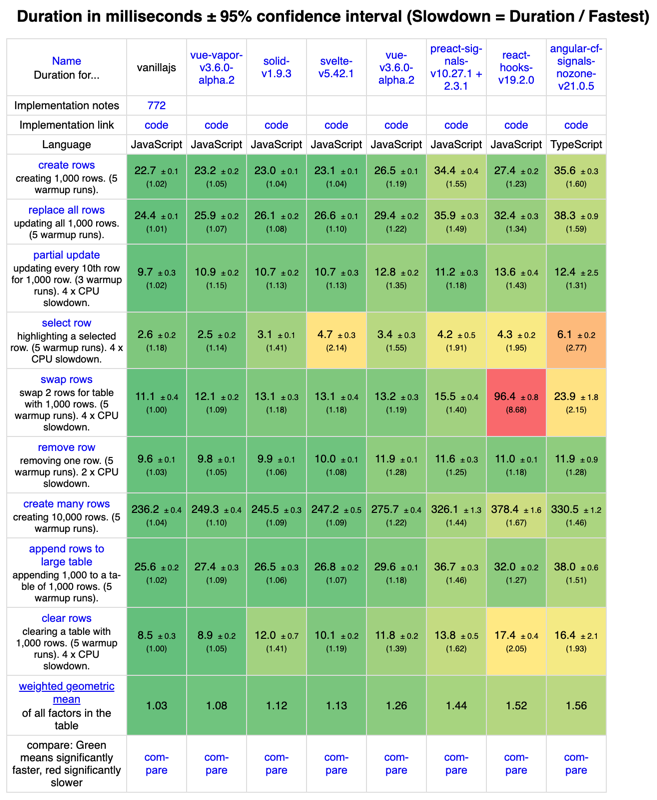
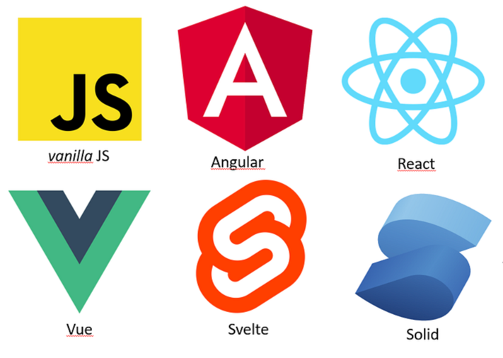
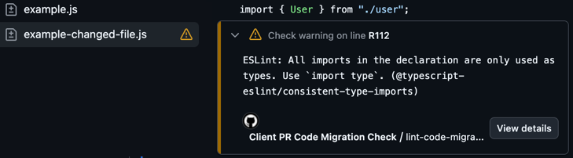

<br>

<h1><span class="the-gradient">Frontend Frameworks</span>Frontend Frameworks 2026</h1>

<style>
h1 {
    position: relative;
}
.the-gradient {
    background-image: linear-gradient(to right, #00d9a7, white);
    color: transparent;
    background-clip: text;
    position: absolute;
    top: 0;
    left: 0;
    text-shadow: none;
}
</style>

---
layout: two-cols-header
layoutClass: gap-x-8
hideInToc: true
---

# Why do we have so many frontend frameworks?

::left::



::right::

- **React**
- **Vue**
- **Angular**
- **Svelte**
- **Preact**
- **Solid**
- **Lit**
- **Astro**
- **Qwik**

---
hideInToc: true
---

# Agenda

<Toc minDepth="1" maxDepth="1" />

---
hideInToc: true
---

# What a frontend framework consists of

<v-clicks>

- Change detection: `UI = func(state)`
- Router
- HTTP client
- Bundler + CLI
- Style manager
- State manager
- Others: From validator, asset manager, etc.

</v-clicks>

---
layout: intro
---

# Change detection


Covers Angular vs React vs Vue vs Svelte vs Solid vs Lit

---

# Change detection

<v-click>

Vanilla JS and jQuery:

```js
on(EVENT) => manipulate DOM
```

</v-click>

<v-click>

Change detection frameworks:

```js
UI = component(state);
```

</v-click>

<v-click>

But how does the new UI get rendered when the state changes?

</v-click>

<v-clicks>

- Dirty checking
- Virtual DOM
- Fine-grained reactivity

</v-clicks>

---
hideInToc: true
---

# Changed detection strategies

<div class="flex gap-x-4">



<v-click>



</v-click>

</div>

---
hideInToc: true
---

# Dirty checking

````md magic-move
```js
html`<div>
  <h1>Static content</h1>
  <p>${state}</p>
</div>`;
```

```js
html`<div>
  <h1>Static content</h1>
  <p>${state}</p>
</div>`;

function html(template, ...bindings) {
  if (initial render) {
    render template;
  }
}
```

```js
html`<div>
  <h1>Static content</h1>
  <p>${state}</p>
</div>`;

let prevBindings = [];
function html(template, ...bindings) {
  if (initial render) {
    render template;
  } else {
    return diff(prevBindings, bindings);
  }
}
```

```js
html`<div>
  <h1>Static content</h1>
  <p>${state}</p>
</div>`;

let prevBindings = [];
function html(template, ...bindings) {
  if (initial render) {
    render template;
  } else {
    return diff(prevBindings, bindings);
  }
}

function diff(prevBndings, newBindings)  {
  for (each binding) {
    update DOM if (prevBinding !== newBinding)
  }
}
```

```js
html`<div>
  <h1>Static content</h1>
  <p>${state}</p>
</div>`;

let prevBindings = [];
function html(template, ...bindings) {
  if (initial render) {
    render template;
  } else {
    return diff(prevBindings, bindings);
  }
}

function diff(prevBndings, newBindings)  {
  for (each binding) {
    update DOM if (prevBinding !== newBinding)
  }
  prevBindings = newBindings;
}
```
````

---
layout: two-cols-header
layoutClass: gap-x-8
hideInToc: true
---

# Virtual DOM

::left::

````md magic-move
```jsx
// JSX
<div>
  <h1>Static content</h1>
  <p>{state}</p>
</div>
```

```js
// virtual DOM
h(
  "div",

  h("h1", "Static content"),
  h("p", state),
);
```

```js
h(
  "div",

  h("h1", "Static content"),
  h("p", state),
);

// construct a virtual DOM tree
function h(type, args, children) {
  return { type, args, children };
}
```

```js
h("div", h("h1", "Static content"), h("p", state));

function h() {...}
```

```js
h("div", h("h1", "Static content"), h("p", state));

function h() {...}

function diff(oldH, newH) {
  if (oldH.type !== newH.type) {
    replace oldVNode with newVNode;
  } else if (attributes changed) {
    update attributes;
  } else {
    diff(oldH.children, newH.children);
  }
}
```
````

::right::



---
hideInToc: true
---

# Dirty checking vs Virtual DOM

**Dirty checking:**

- Native DOM APIs (No recreating the DOM in memory)
- Simpler to implement
- One pass to update the DOM
- Static content isn't checked

**Virtual DOM:**

- Works in other environments (e.g. React Native)
- Two passes to update the DOM (construct virtual DOM, then diff)
- Batch updates together

---
hideInToc: true
---

# Svelte v4: dirty checking at compile time

````md magic-move
```svelte
<script>
  let count = 0;
</script>

<h1>Static content</h1>
<p>{count}</p>
<button on:click={() => count++}>+</button>
```

```js {*|2-9|10-14}
function mount(target) {
  target.innerHTML = `<h1>Static content</h1>`;

  const p = document.createElement("p");
  p.textContent = count;

  const btn = document.createElement("button");
  btn.textContent = "+";
  target.append(h1, p, btn);

  btn.addEventListener("click", () => {
    count++;
    update(1);
  });
}
```

```js {17-19|*}
function mount(target) {
  target.innerHTML = `<h1>Static content</h1>`;

  const p = document.createElement("p");
  p.textContent = count;

  const btn = document.createElement("button");
  btn.textContent = "+";
  target.append(h1, p, btn);

  btn.addEventListener("click", () => {
    count++;
    update(count);
  });
}

function update(count) {
  p.textContent = count;
}
```
````

---

# How do frameworks know state changed?

<v-clicks>

- Monkey-patching every API. Zone.js -> Angular
- `setState` -> React
- Compile-time analysis -> Svelte

</v-clicks>

<!--
- Without zone.js, Angular wouldn't know when state is changed. Mutation is detected by Angular
-->

---

# Changed detection strategies

<div class="flex h-100%">


</div>

<!--
Before explaining signals: signals are primitives and there's no change-detection system. Signals themselves are reactive.
-->

---

# Fine-grained reactivity (signals)

````md magic-move
```jsx
function Parent() {
  const [count, setCount] = createSignal(0);
  console.log("Parent rendered"); // logs ONCE on mount

  return (
    <h2>Counter</h2>
    <button onClick={() => setCount(count() + 1)}>+</button>
    <span>{count()}</span>
  );
}
```

```jsx
function Parent() {
  const [count, setCount] = createSignal(0);
  console.log("Parent rendered");

  return (
    <h2>Counter</h2>
    <button onClick={() => setCount(count() + 1)}>+</button>
    <Child count={count} />
  );
}

function Child(props) {
  console.log("Child rendered"); // logs ONCE on mount
  return (
    <h3>Current value</h3>
    <p>The count is: {props.count()}</p>
  );
}
```
````

---
layout: two-cols-header
layoutClass: gap-x-8
---

# Signals are becoming more popular

::left::

- Solid is built on signals
- Angular added signals, made them default, introduced zone-less
- Preact added signals
- Vue added signals in Vue Vapor
- Svelte added signals
- JavaScript: signals spec in stage 1

::right::

<v-click>

| Framework | Change detection                  |
| --------- | --------------------------------- |
| React     | Virtual DOM                       |
| Preact    | Virtual DOM + Signals             |
| Angular   | Signals (zoneless)                |
| Vue       | Virtual DOM + Signals (Vue Vapor) |
| Svelte    | Compile-time Signals              |
| Solid     | Signals                           |

</v-click>

<!--
- Angular started with Angular.js and action script then switch to Dart then TS. catching up on TypeScript and signals is impressive.
- React proxies events `SyntheticEvent` because browsers had different APIs. Preact removed them.
- `SyntheticEvent` is why some APIs aren't supported in React.
-->

---

<div class="flex h-100%">



</div>

---
layout: two-cols-header
layoutClass: gap-x-8
---

# Framework? Library? Vite?

::left::

<v-clicks>

- Full framework: <span class="text-red">Angular</span>,
  <span class="text-green">Vue</span>, <span class="text-orange">Svelte
  (SvelteKit)</span> , <span class="text-sky">Solid (SolidStart)</span> with
  built-in router, data fetching, ssr, etc.

- <span class="text-blue">React</span>: need external libraries for routing,
  data fetching, ssr, etc. (<span class="text-cyan">React Router</span>,
  <span class="text-gray">Tanstack Query</span>,
  <span class="text-slate">Next.js</span>)

- <span class="text-purple">Vite</span> is a bundler. All frameworks use Vite
  except Next.js (Turbopack)

</v-clicks>

::right::

<v-click at="1">



</v-click>

<v-click at="2">


</v-click>

<v-click at="3">


</v-click>

<!--
It's worth mentioning that React by itself isn't a full framework. For routing, data fetching, state management, styling, etc. you need external libraries.
Angular is battery-included. Vue is somewhere in between. Svelte and Solid have SvelteKit and SolidStart.
-->

---

# Lit: Web components

```html
<simple-greeting name="World"></simple-greeting>
```

```js
@customElement("simple-greeting")
export class SimpleGreeting extends LitElement {
  static styles = css`
    p {
      color: blue;
    }
  `;

  @property()
  name = "Somebody";

  render() {
    return html`<p>Hello, ${this.name}!</p>`;
  }
}
```

<!--
Lit is a very simple framework for building web components. It uses dirty checking.
-->

---

# SSR

Run the client code in server, get the html, send html and bundle to client,
hyderate

Problems is when your site has mostly static content (like blogs), sending the
bundle again and running it twice (server and client) isn't efficient.

Solutions:

- SSG: Build once (client or server + cache) but still bundle is run twice
- RSC with Next.js App Router
- Astro Islands
- Qwik resumability

---

# Astro: Islands architecture

---

# Frameworks at a glance

| Framework | Change detection                     | Bundler               | Router, SSR/SSG              | Data fetching | Template syntax |
| --------- | ------------------------------------ | --------------------- | ---------------------------- | ------------- | --------------- |
| Angular   | Signals (zoneless) or Dirty checking | devkit (Vite)         | Built-in                     | v17+          | Templates       |
| React     | Virtual DOM                          | Vite, Turbopack, etc. | Tanstack, React router, Next | No            | JSX             |
| Vue       | Virtual DOM + Signals                | Vite, etc.            | Built-in, Nuxt               | Yes           | Templates / JSX |
| Svelte    | Compile-time + Signals               | Vite                  | SvelteKit                    | v5+           | Templates       |
| Solid     | Signals                              | Vite                  | SolidStart                   | Yes           | JSX             |
| Lit       | Dirty checking                       | 2018                  | No                           | Via lib       | Tagged literals |
| Astro     | Islands / Static                     | 2021                  |                              | Via lib       | `.astro`        |
| Qwik      | Resumability + signals               | 2022                  |                              | Yes           | JSX             |
| HTMX      | Server-driven                        | 2020                  |                              | No            | HTML attrs      |
| Alpine.js | Reactive proxies                     | 2019                  |                              | No            | HTML attrs      |

---

[//]:
  #
  "from here on the conetnt is from an old slide and shuold be removed. I've kept to so I can get inspired by it"

#### One exception: **code formatting**

Use `.git-blame-ignore-revs` to hide formatting commits

::right::

<div v-click="[2, 3]">

<a href="#" class="tabnav-tab">
<svg aria-hidden="true" height="16" viewBox="0 0 16 16" version="1.1" width="16">
<path d="M1 1.75C1 .784 1.784 0 2.75 0h7.586c.464 0 .909.184 1.237.513l2.914 2.914c.329.328.513.773.513 1.237v9.586A1.75 1.75 0 0 1 13.25 16H2.75A1.75 1.75 0 0 1 1 14.25Zm1.75-.25a.25.25 0 0 0-.25.25v12.5c0 .138.112.25.25.25h10.5a.25.25 0 0 0 .25-.25V4.664a.25.25 0 0 0-.073-.177l-2.914-2.914a.25.25 0 0 0-.177-.073ZM8 3.25a.75.75 0 0 1 .75.75v1.5h1.5a.75.75 0 0 1 0 1.5h-1.5v1.5a.75.75 0 0 1-1.5 0V7h-1.5a.75.75 0 0 1 0-1.5h1.5V4A.75.75 0 0 1 8 3.25Zm-3 8a.75.75 0 0 1 .75-.75h4.5a.75.75 0 0 1 0 1.5h-4.5a.75.75 0 0 1-.75-.75Z"></path>
</svg>
Files changed
 <span id="files_tab_counter" title="5" data-view-component="true" class="Counter">99+</span>
</a>
<span class="diffstat">
<span class="color-fg-success">
+9999
</span>
<span class="color-fg-danger">
−9999
</span>
</span>

<span>
 <span class="diffstat-block-added"></span>
<span class="diffstat-block-added"></span>
<span class="diffstat-block-deleted"></span>
<span class="diffstat-block-deleted"></span>
<span class="diffstat-block-neutral"></span>
</span>

</div>

<div v-click="[3, 4]">

<div class="git-blame">
 <div class="blame-line"><span class="blame-author">Vahid</span><span class="blame-date">2 days ago</span><span class="blame-code">import { type User } from './user'</span></div>
 <div class="blame-line"><span class="blame-author">Vahid</span><span class="blame-date">2 days ago</span><span class="blame-code">import { type Order } from './order'</span></div>
 <div class="blame-line"><span class="blame-author">Vahid</span><span class="blame-date">2 days ago</span><span class="blame-code">import { type Cart } from './cart'</span></div>
</div>

</div>

<style>
.diffstat-block-deleted, .diffstat-block-added, .diffstat-block-neutral {
    display: inline-block;
    width: 0.5rem;
    height: 0.5rem;
    margin-left: 1px;
}
.diffstat-block-added {
    background-color: #3fb950;
}
.diffstat-block-deleted {
    background-color: #f85149;
}
.diffstat-block-neutral {
    background-color: #8b949e;
}
.Counter {
    background-color: #444;
    border-radius: 2em;
    color: #ffffff;
    display: inline-block;
    min-width: 20px;
    padding: 0 4px;
    text-align: center;
}
.tabnav-tab {
    display: inline-flex;
gap: 8px;
    align-items: center;
    font-size: 0.875rem;
    font-weight: 600;
    color: #c9d1d9;
    background-color: #161b22;
    padding: 6px 12px;
    border-radius: 6px;
    border: 1px solid #30363d;
    text-decoration: none;
svg {
color: #8b949e;
fill: #8b949e;
}
}
.diffstat {
  margin-left: 8px;
}
.color-fg-success {
  color: #3fb950;
}
.color-fg-danger {
  color: #f85149;
}
.git-blame {
  font-family: 'Fira Code', monospace;
  font-size: 0.6rem;
  background: #161b22;
  border-radius: 6px;
  padding: 0.5rem;
  border: 1px solid #30363d;
}
.blame-line {
  display: flex;
  gap: 1rem;
  padding: 2px 0;
  border-bottom: 1px solid #21262d;
}
.blame-line:last-child {
  border-bottom: none;
}
.blame-author {
  color: #f78166;
  min-width: 20px;
}
.blame-date {
  color: #7d8590;
  min-width: 40px;
}
.blame-code {
  color: #e6edf3;
}
</style>

<!--
Although it's tempting to do migrations in one big commit.

[click] It's hard to test
[click] Hard to review
[click] And you'll own the entire codebase from that point
[click] Also, if something goes wrong, it's difficult to revert
[click] And you'll face merge conflicts

[click] The only exception is purely cosmetic changes. `.git-blame-ignore-revs` hides those commits from blame.
-->

---

## Example: TypeScript `verbatimModuleSyntax`

Adding explicit `import type`:

````md magic-move
```ts
// Before: ambiguous imports
import { User, UserService } from "./user";
```

```ts
// After: explicit type imports
import { type User, UserService } from "./user";
```
````

<style>
.slidev-code-wrapper {
--slidev-code-font-size: 18px;
--slidev-code-line-height: 22px;
}
</style>

<!--
Let's look at a simple example: we want to add explicit type imports to enable `verbatimModuleSyntax` in `tsconfig`.

[click] Like this.

It's a straightforward migration, but thousands of files need this change and we can't do it in one PR.
-->

---

layout: two-cols-header layoutClass: gap-x-8

---

# How a Good Migration Strategy Looks

::left::

<v-clicks depth="2">

1. **Detect legacy patterns**:
   - Regex (grep)
   - Linters
   - ```ts
     function hasLegacy(file): boolean;
     ```
2. **Migrate gradually**:
   - Ideally immediate feedback in IDEs
   - GitHub annotations for PRs
   - Fail CI for new code
3. **Track progress**:
   - Easy to see remaining work
   - Incentivise completion
   - Justify tech investments

</v-clicks>

::right::

<div v-click="[6, 7]" class="mt-35">

```ts twoslash
import { User } from "./user";
```

</div>

<div v-click="[7, 8]" class="mt-0">



</div>

<style>
.twoslash .twoslash-hover {
    border-bottom: 1px dashed;
}
</style>

<!--
Here are the key steps for a successful migration strategy:

[click] First, identify deprecated code.
[click] This can be a regular expression, [click] a lint rule, [click] or a function that detects legacy patterns in files.
[click] Then, to facilitate gradual migration:
[click] Ideally, we need IDE feedback. Engineers should see warnings or errors with guidance on how to migrate.
[click] Some checks are only possible in CI. Use GitHub annotations for those. We use ReviewDog, which displays warnings in the GitHub UI just like IDEs do.
[click] You can also fail CI only for changed files or changed lines. Again, we use ReviewDog. This way, our migration CI doesn't fail if untouched files contain deprecated patterns.
[click] We also need to monitor progress to show what remains, [click] motivate engineers, and [click] justify tech investments.
-->

---

layout: two-cols-header layoutClass: gap-x-8

---

# Our Approach at Accurx

::left::

<v-clicks depth="2">

- ESLint rules
- Custom ESLint rules
- Other tools (Knip for dead code)
- Custom scripts (`find -name` or `grep`)
- Define code areas by domain
- Calculate health scores

</v-clicks>

::right::

<v-click at="1">

````md magic-move {at:2}
```json
{
  "migrations": [
    {
      "file": "domains/conversations/Message.tsx",
      "group": "Eslint: consistent-type-imports",
      "occurrences": 3
    }
  ]
}
```

```json {8-12}
{
  "migrations": [
    {
      "file": "domains/conversations/Message.tsx",
      "group": "Eslint: consistent-type-imports",
      "occurrences": 3
    },
    {
      "file": "domains/user/UserProfile.ts",
      "group": "Eslint: @accurx/no-deprecated-table",
      "occurrences": 1
    }
  ]
}
```

```json {13-16}
{
  "migrations": [
    {
      "file": "domains/conversations/Message.tsx",
      "group": "Eslint: consistent-type-imports",
      "occurrences": 3
    },
    {
      "file": "domains/user/UserProfile.ts",
      "group": "Eslint: @accurx/no-deprecated-table",
      "occurrences": 1
    },
    {
      "file": "domains/triage/Old.tsx",
      "group": "Knip: unused-file"
    }
  ]
}
```

```json {17-20}
{
  "migrations": [
    {
      "file": "domains/conversations/Message.tsx",
      "group": "Eslint: consistent-type-imports",
      "occurrences": 3
    },
    {
      "file": "domains/user/UserProfile.ts",
      "group": "Eslint: @accurx/no-deprecated-table",
      "occurrences": 1
    },
    {
      "file": "domains/triage/Old.tsx",
      "group": "Knip: unused-file"
    },
    {
      "file": "domains/scribe/legacy.test.tsx",
      "group": "Script: migrate-to-vitest"
    }
  ]
}
```

```json {2-8|6}
{
  "areas": [
    {
      "name": "Conversation",
      "paths": ["domains/conversation/**/*"],
      "healthScore": 90.5
    }
  ],
  "migrations": [
    {
      "file": "domains/conversations/Message.tsx",
      "group": "Eslint: consistent-type-imports",
      "occurrences": 3
    },
    {
      "file": "domains/user/UserProfile.ts",
      "group": "Eslint: @accurx/no-deprecated-table",
      "occurrences": 1
    },
    {
      "file": "domains/triage/Old.tsx",
      "group": "Knip: unused-file"
    },
    {
      "file": "domains/scribe/legacy.test.tsx",
      "group": "Script: migrate-to-vitest"
    }
  ]
}
```
````

</v-click>

<!--
Here's how we implement this approach at Accurx.
[click] We use ESLint rules for common patterns and convert the output to a simple JSON format.
[click] We also create custom ESLint rules for project-specific patterns.
[click] We use other tools such as Knip for unused code, again converting its output to the same JSON format.
[click] We can even use custom scripts, such as file name pattern matching.
[click] Then we aggregate the results into a unified JSON report,
[click] define code areas by domain, and [click] calculate health scores.
-->

---

# Visualise in a Dashboard

We use Grafana to visualise migration progress.

<v-switch>
<template #1>

**Track each migration's progress**

<div class="heatmap">
  <div class="heatmap-row">
    <span class="heatmap-label">Eslint: @accurx/no-deprecated-text</span>
    <span class="heatmap-cells">
<i style=" background-image: radial-gradient( rgba(115, 191, 105, 0.95) 10%, rgba(115, 191, 105, 0.55) ); " /> <i style=" background-image: radial-gradient( rgba(122, 193, 102, 0.95) 10%, rgba(122, 193, 102, 0.55) ); " /> <i style=" background-image: radial-gradient( rgba(129, 194, 98, 0.95) 10%, rgba(129, 194, 98, 0.55) ); " /> <i style=" background-image: radial-gradient( rgba(136, 196, 95, 0.95) 10%, rgba(136, 196, 95, 0.55) ); " /> <i style=" background-image: radial-gradient( rgba(143, 197, 92, 0.95) 10%, rgba(143, 197, 92, 0.55) ); " /> <i style=" background-image: radial-gradient( rgba(150, 199, 89, 0.95) 10%, rgba(150, 199, 89, 0.55) ); " /> <i style=" background-image: radial-gradient( rgba(157, 200, 86, 0.95) 10%, rgba(157, 200, 86, 0.55) ); " /> <i style=" background-image: radial-gradient( rgba(164, 201, 83, 0.95) 10%, rgba(164, 201, 83, 0.55) ); " /> <i style=" background-image: radial-gradient( rgba(170, 202, 80, 0.95) 10%, rgba(170, 202, 80, 0.55) ); " /> <i style=" background-image: radial-gradient( rgba(176, 202, 77, 0.95) 10%, rgba(176, 202, 77, 0.55) ); " /> <i style=" background-image: radial-gradient( rgba(183, 203, 75, 0.95) 10%, rgba(183, 203, 75, 0.55) ); " /> <i style=" background-image: radial-gradient( rgba(189, 203, 72, 0.95) 10%, rgba(189, 203, 72, 0.55) ); " /> <i style=" background-image: radial-gradient( rgba(194, 203, 70, 0.95) 10%, rgba(194, 203, 70, 0.55) ); " /> <i style=" background-image: radial-gradient( rgba(200, 203, 68, 0.95) 10%, rgba(200, 203, 68, 0.55) ); " /> <i style=" background-image: radial-gradient( rgba(205, 202, 66, 0.95) 10%, rgba(205, 202, 66, 0.55) ); " /> <i style=" background-image: radial-gradient( rgba(210, 201, 65, 0.95) 10%, rgba(210, 201, 65, 0.55) ); " /> <i style=" background-image: radial-gradient( rgba(214, 199, 63, 0.95) 10%, rgba(214, 199, 63, 0.55) ); " /> <i style=" background-image: radial-gradient( rgba(219, 197, 62, 0.95) 10%, rgba(219, 197, 62, 0.55) ); " /> <i style=" background-image: radial-gradient( rgba(223, 195, 61, 0.95) 10%, rgba(223, 195, 61, 0.55) ); " /> <i style=" background-image: radial-gradient( rgba(226, 192, 61, 0.95) 10%, rgba(226, 192, 61, 0.55) ); " /> <i style=" background-image: radial-gradient( rgba(229, 189, 61, 0.95) 10%, rgba(229, 189, 61, 0.55) ); " /> <i style=" background-image: radial-gradient( rgba(232, 185, 61, 0.95) 10%, rgba(232, 185, 61, 0.55) ); " /> <i style=" background-image: radial-gradient( rgba(235, 181, 61, 0.95) 10%, rgba(235, 181, 61, 0.55) ); " /> <i style=" background-image: radial-gradient( rgba(237, 176, 62, 0.95) 10%, rgba(237, 176, 62, 0.55) ); " /> <i style=" background-image: radial-gradient( rgba(238, 171, 63, 0.95) 10%, rgba(238, 171, 63, 0.55) ); " /> <i style=" background-image: radial-gradient( rgba(240, 165, 64, 0.95) 10%, rgba(240, 165, 64, 0.55) ); " /> <i style=" background-image: radial-gradient( rgba(241, 160, 65, 0.95) 10%, rgba(241, 160, 65, 0.55) ); " /> <i style=" background-image: radial-gradient( rgba(242, 153, 67, 0.95) 10%, rgba(242, 153, 67, 0.55) ); " /> <i style=" background-image: radial-gradient( rgba(243, 147, 68, 0.95) 10%, rgba(243, 147, 68, 0.55) ); " /> <i style=" background-image: radial-gradient( rgba(244, 133, 72, 0.95) 10%, rgba(244, 133, 72, 0.55) ); " /> <i style=" background-image: radial-gradient( rgba(244, 126, 75, 0.95) 10%, rgba(244, 126, 75, 0.55) ); " /> <i style=" background-image: radial-gradient( rgba(244, 112, 79, 0.95) 10%, rgba(244, 112, 79, 0.55) ); " /> <i style=" background-image: radial-gradient( rgba(243, 104, 82, 0.95) 10%, rgba(243, 104, 82, 0.55) ); " /> <i style=" background-image: radial-gradient( rgba(243, 96, 84, 0.95) 10%, rgba(243, 96, 84, 0.55) ); " /> <i style=" background-image: radial-gradient( rgba(243, 89, 87, 0.95) 10%, rgba(243, 89, 87, 0.55) ); " /> <i style=" background-image: radial-gradient( rgba(242, 77, 91, 0.95) 10%, rgba(242, 77, 91, 0.55) ); " />
    </span>
    <span class="heatmap-count" style="color:#f85149">90</span>
  </div>
  <div class="heatmap-row">
    <span class="heatmap-label">Eslint: @accurx/no-bootstrap-utilities</span>
    <span class="heatmap-cells">
<i style=" background-image: radial-gradient( rgba(115, 191, 105, 0.95) 10%, rgba(115, 191, 105, 0.55) ); " /> <i style=" background-image: radial-gradient( rgba(122, 193, 102, 0.95) 10%, rgba(122, 193, 102, 0.55) ); " /> <i style=" background-image: radial-gradient( rgba(129, 194, 98, 0.95) 10%, rgba(129, 194, 98, 0.55) ); " /> <i style=" background-image: radial-gradient( rgba(136, 196, 95, 0.95) 10%, rgba(136, 196, 95, 0.55) ); " /> <i style=" background-image: radial-gradient( rgba(143, 197, 92, 0.95) 10%, rgba(143, 197, 92, 0.55) ); " /> <i style=" background-image: radial-gradient( rgba(150, 199, 89, 0.95) 10%, rgba(150, 199, 89, 0.55) ); " /> <i style=" background-image: radial-gradient( rgba(157, 200, 86, 0.95) 10%, rgba(157, 200, 86, 0.55) ); " /> <i style=" background-image: radial-gradient( rgba(164, 201, 83, 0.95) 10%, rgba(164, 201, 83, 0.55) ); " /> <i style=" background-image: radial-gradient( rgba(170, 202, 80, 0.95) 10%, rgba(170, 202, 80, 0.55) ); " /> <i style=" background-image: radial-gradient( rgba(176, 202, 77, 0.95) 10%, rgba(176, 202, 77, 0.55) ); " /> <i style=" background-image: radial-gradient( rgba(183, 203, 75, 0.95) 10%, rgba(183, 203, 75, 0.55) ); " /> <i style=" background-image: radial-gradient( rgba(189, 203, 72, 0.95) 10%, rgba(189, 203, 72, 0.55) ); " /> <i style=" background-image: radial-gradient( rgba(194, 203, 70, 0.95) 10%, rgba(194, 203, 70, 0.55) ); " /> <i style=" background-image: radial-gradient( rgba(200, 203, 68, 0.95) 10%, rgba(200, 203, 68, 0.55) ); " /> <i style=" background-image: radial-gradient( rgba(205, 202, 66, 0.95) 10%, rgba(205, 202, 66, 0.55) ); " /> <i style=" background-image: radial-gradient( rgba(210, 201, 65, 0.95) 10%, rgba(210, 201, 65, 0.55) ); " /> <i style=" background-image: radial-gradient( rgba(214, 199, 63, 0.95) 10%, rgba(214, 199, 63, 0.55) ); " /> <i style=" background-image: radial-gradient( rgba(219, 197, 62, 0.95) 10%, rgba(219, 197, 62, 0.55) ); " /> <i style=" background-image: radial-gradient( rgba(223, 195, 61, 0.95) 10%, rgba(223, 195, 61, 0.55) ); " /> <i style=" background-image: radial-gradient( rgba(226, 192, 61, 0.95) 10%, rgba(226, 192, 61, 0.55) ); " /> <i style=" background-image: radial-gradient( rgba(229, 189, 61, 0.95) 10%, rgba(229, 189, 61, 0.55) ); " /> <i style=" background-image: radial-gradient( rgba(232, 185, 61, 0.95) 10%, rgba(232, 185, 61, 0.55) ); " /> <i style=" background-image: radial-gradient( rgba(235, 181, 61, 0.95) 10%, rgba(235, 181, 61, 0.55) ); " /> <i style=" background-image: radial-gradient( rgba(237, 176, 62, 0.95) 10%, rgba(237, 176, 62, 0.55) ); " /> <i style=" background-image: radial-gradient( rgba(238, 171, 63, 0.95) 10%, rgba(238, 171, 63, 0.55) ); " /> <i style=" background-image: radial-gradient( rgba(240, 165, 64, 0.95) 10%, rgba(240, 165, 64, 0.55) ); " /> <i style=" background-image: radial-gradient( rgba(241, 160, 65, 0.95) 10%, rgba(241, 160, 65, 0.55) ); " /> <i style=" background-image: radial-gradient( rgba(242, 153, 67, 0.95) 10%, rgba(242, 153, 67, 0.55) ); " /> <i style=" background-image: radial-gradient( rgba(243, 147, 68, 0.95) 10%, rgba(243, 147, 68, 0.55) ); " /> <i style=" background-image: radial-gradient( rgba(244, 133, 72, 0.95) 10%, rgba(244, 133, 72, 0.55) ); " /> <i style=" background-image: radial-gradient( rgba(244, 126, 75, 0.95) 10%, rgba(244, 126, 75, 0.55) ); " /> <i style=" background-image: radial-gradient( rgba(244, 112, 79, 0.95) 10%, rgba(244, 112, 79, 0.55) ); " /> <i style=" background-image: radial-gradient( rgba(243, 104, 82, 0.95) 10%, rgba(243, 104, 82, 0.55) ); " /> <i style=" background-image: radial-gradient( rgba(243, 96, 84, 0.95) 10%, rgba(243, 96, 84, 0.55) ); " /> <i style=" background-image: radial-gradient( rgba(243, 89, 87, 0.95) 10%, rgba(243, 89, 87, 0.55) ); " /> <i style=" background-image: radial-gradient( rgba(242, 77, 91, 0.95) 10%, rgba(242, 77, 91, 0.55) ); " />
    </span>
    <span class="heatmap-count" style="color:#d4a72c">32</span>
  </div>
  <div class="heatmap-row">
    <span class="heatmap-label">Eslint: consistent-type-imports</span>
    <span class="heatmap-cells">
<i style=" background-image: radial-gradient( rgba(115, 191, 105, 0.95) 10%, rgba(115, 191, 105, 0.55) ); " /> <i style=" background-image: radial-gradient( rgba(122, 193, 102, 0.95) 10%, rgba(122, 193, 102, 0.55) ); " /> <i style=" background-image: radial-gradient( rgba(129, 194, 98, 0.95) 10%, rgba(129, 194, 98, 0.55) ); " /> <i style=" background-image: radial-gradient( rgba(136, 196, 95, 0.95) 10%, rgba(136, 196, 95, 0.55) ); " /> <i style=" background-image: radial-gradient( rgba(143, 197, 92, 0.95) 10%, rgba(143, 197, 92, 0.55) ); " /> <i style=" background-image: radial-gradient( rgba(150, 199, 89, 0.95) 10%, rgba(150, 199, 89, 0.55) ); " /> <i style=" background-image: radial-gradient( rgba(157, 200, 86, 0.95) 10%, rgba(157, 200, 86, 0.55) ); " /> <i style=" background-image: radial-gradient( rgba(164, 201, 83, 0.95) 10%, rgba(164, 201, 83, 0.55) ); " /> <i style=" background-image: radial-gradient( rgba(170, 202, 80, 0.95) 10%, rgba(170, 202, 80, 0.55) ); " /> <i style=" background-image: radial-gradient( rgba(176, 202, 77, 0.95) 10%, rgba(176, 202, 77, 0.55) ); " /> <i style=" background-image: radial-gradient( rgba(183, 203, 75, 0.95) 10%, rgba(183, 203, 75, 0.55) ); " /> <i style=" background-image: radial-gradient( rgba(189, 203, 72, 0.95) 10%, rgba(189, 203, 72, 0.55) ); " /> <i style=" background-image: radial-gradient( rgba(194, 203, 70, 0.95) 10%, rgba(194, 203, 70, 0.55) ); " /> <i style=" background-image: radial-gradient( rgba(200, 203, 68, 0.95) 10%, rgba(200, 203, 68, 0.55) ); " /> <i style=" background-image: radial-gradient( rgba(205, 202, 66, 0.95) 10%, rgba(205, 202, 66, 0.55) ); " /> <i style=" background-image: radial-gradient( rgba(210, 201, 65, 0.95) 10%, rgba(210, 201, 65, 0.55) ); " /> <i style=" background-image: radial-gradient( rgba(214, 199, 63, 0.95) 10%, rgba(214, 199, 63, 0.55) ); " /> <i style=" background-image: radial-gradient( rgba(219, 197, 62, 0.95) 10%, rgba(219, 197, 62, 0.55) ); " /> <i style=" background-image: radial-gradient( rgba(223, 195, 61, 0.95) 10%, rgba(223, 195, 61, 0.55) ); " /> <i style=" background-image: radial-gradient( rgba(226, 192, 61, 0.95) 10%, rgba(226, 192, 61, 0.55) ); " /> <i style=" background-image: radial-gradient( rgba(229, 189, 61, 0.95) 10%, rgba(229, 189, 61, 0.55) ); " /> <i style=" background-image: radial-gradient( rgba(232, 185, 61, 0.95) 10%, rgba(232, 185, 61, 0.55) ); " /> <i style=" background-image: radial-gradient( rgba(235, 181, 61, 0.95) 10%, rgba(235, 181, 61, 0.55) ); " /> <i style=" background-image: radial-gradient( rgba(237, 176, 62, 0.95) 10%, rgba(237, 176, 62, 0.55) ); " /> <i style=" background-image: radial-gradient( rgba(238, 171, 63, 0.95) 10%, rgba(238, 171, 63, 0.55) ); " /> <i style=" background-image: radial-gradient( rgba(240, 165, 64, 0.95) 10%, rgba(240, 165, 64, 0.55) ); " /> <i style=" background-image: radial-gradient( rgba(241, 160, 65, 0.95) 10%, rgba(241, 160, 65, 0.55) ); " /> <i style=" background-image: radial-gradient( rgba(242, 153, 67, 0.95) 10%, rgba(242, 153, 67, 0.55) ); " /> <i style=" background-image: radial-gradient( rgba(243, 147, 68, 0.95) 10%, rgba(243, 147, 68, 0.55) ); " /> <i style=" background-image: radial-gradient( rgba(244, 133, 72, 0.95) 10%, rgba(244, 133, 72, 0.55) ); " /> <i style=" background-image: radial-gradient( rgba(244, 126, 75, 0.95) 10%, rgba(244, 126, 75, 0.55) ); " /> <i style=" background-image: radial-gradient( rgba(244, 112, 79, 0.95) 10%, rgba(244, 112, 79, 0.55) ); " /> <i style=" background-image: radial-gradient( rgba(243, 104, 82, 0.95) 10%, rgba(243, 104, 82, 0.55) ); " /> <i style=" background-image: radial-gradient( rgba(243, 96, 84, 0.95) 10%, rgba(243, 96, 84, 0.55) ); " /> <i style=" background-image: radial-gradient( rgba(243, 89, 87, 0.95) 10%, rgba(243, 89, 87, 0.55) ); " /> <i style=" background-image: radial-gradient( rgba(242, 77, 91, 0.95) 10%, rgba(242, 77, 91, 0.55) ); " />
    </span>
    <span class="heatmap-count" style="color:#7cb342">19</span>
  </div>
  <div class="heatmap-row">
    <span class="heatmap-label">Knip: unused-file</span>
    <span class="heatmap-cells">
<i style=" background-image: radial-gradient( rgba(115, 191, 105, 0.95) 10%, rgba(115, 191, 105, 0.55) ); " /> <i style=" background-image: radial-gradient( rgba(122, 193, 102, 0.95) 10%, rgba(122, 193, 102, 0.55) ); " /> <i style=" background-image: radial-gradient( rgba(129, 194, 98, 0.95) 10%, rgba(129, 194, 98, 0.55) ); " /> <i style=" background-image: radial-gradient( rgba(136, 196, 95, 0.95) 10%, rgba(136, 196, 95, 0.55) ); " /> <i style=" background-image: radial-gradient( rgba(143, 197, 92, 0.95) 10%, rgba(143, 197, 92, 0.55) ); " /> <i style=" background-image: radial-gradient( rgba(150, 199, 89, 0.95) 10%, rgba(150, 199, 89, 0.55) ); " /> <i style=" background-image: radial-gradient( rgba(157, 200, 86, 0.95) 10%, rgba(157, 200, 86, 0.55) ); " /> <i style=" background-image: radial-gradient( rgba(164, 201, 83, 0.95) 10%, rgba(164, 201, 83, 0.55) ); " /> <i style=" background-image: radial-gradient( rgba(170, 202, 80, 0.95) 10%, rgba(170, 202, 80, 0.55) ); " /> <i style=" background-image: radial-gradient( rgba(176, 202, 77, 0.95) 10%, rgba(176, 202, 77, 0.55) ); " /> <i style=" background-image: radial-gradient( rgba(183, 203, 75, 0.95) 10%, rgba(183, 203, 75, 0.55) ); " /> <i style=" background-image: radial-gradient( rgba(189, 203, 72, 0.95) 10%, rgba(189, 203, 72, 0.55) ); " /> <i style=" background-image: radial-gradient( rgba(194, 203, 70, 0.95) 10%, rgba(194, 203, 70, 0.55) ); " /> <i style=" background-image: radial-gradient( rgba(200, 203, 68, 0.95) 10%, rgba(200, 203, 68, 0.55) ); " /> <i style=" background-image: radial-gradient( rgba(205, 202, 66, 0.95) 10%, rgba(205, 202, 66, 0.55) ); " /> <i style=" background-image: radial-gradient( rgba(210, 201, 65, 0.95) 10%, rgba(210, 201, 65, 0.55) ); " /> <i style=" background-image: radial-gradient( rgba(214, 199, 63, 0.95) 10%, rgba(214, 199, 63, 0.55) ); " /> <i style=" background-image: radial-gradient( rgba(219, 197, 62, 0.95) 10%, rgba(219, 197, 62, 0.55) ); " /> <i style=" background-image: radial-gradient( rgba(223, 195, 61, 0.95) 10%, rgba(223, 195, 61, 0.55) ); " /> <i style=" background-image: radial-gradient( rgba(226, 192, 61, 0.95) 10%, rgba(226, 192, 61, 0.55) ); " /> <i style=" background-image: radial-gradient( rgba(229, 189, 61, 0.95) 10%, rgba(229, 189, 61, 0.55) ); " /> <i style=" background-image: radial-gradient( rgba(232, 185, 61, 0.95) 10%, rgba(232, 185, 61, 0.55) ); " /> <i style=" background-image: radial-gradient( rgba(235, 181, 61, 0.95) 10%, rgba(235, 181, 61, 0.55) ); " /> <i style=" background-image: radial-gradient( rgba(237, 176, 62, 0.95) 10%, rgba(237, 176, 62, 0.55) ); " /> <i style=" background-image: radial-gradient( rgba(238, 171, 63, 0.95) 10%, rgba(238, 171, 63, 0.55) ); " /> <i style=" background-image: radial-gradient( rgba(240, 165, 64, 0.95) 10%, rgba(240, 165, 64, 0.55) ); " /> <i style=" background-image: radial-gradient( rgba(241, 160, 65, 0.95) 10%, rgba(241, 160, 65, 0.55) ); " /> <i style=" background-image: radial-gradient( rgba(242, 153, 67, 0.95) 10%, rgba(242, 153, 67, 0.55) ); " /> <i style=" background-image: radial-gradient( rgba(243, 147, 68, 0.95) 10%, rgba(243, 147, 68, 0.55) ); " /> <i style=" background-image: radial-gradient( rgba(244, 133, 72, 0.95) 10%, rgba(244, 133, 72, 0.55) ); " /> <i style=" background-image: radial-gradient( rgba(244, 126, 75, 0.95) 10%, rgba(244, 126, 75, 0.55) ); " /> <i style=" background-image: radial-gradient( rgba(244, 112, 79, 0.95) 10%, rgba(244, 112, 79, 0.55) ); " /> <i style=" background-image: radial-gradient( rgba(243, 104, 82, 0.95) 10%, rgba(243, 104, 82, 0.55) ); " /> <i style=" background-image: radial-gradient( rgba(243, 96, 84, 0.95) 10%, rgba(243, 96, 84, 0.55) ); " /> <i style=" background-image: radial-gradient( rgba(243, 89, 87, 0.95) 10%, rgba(243, 89, 87, 0.55) ); " /> <i style=" background-image: radial-gradient( rgba(242, 77, 91, 0.95) 10%, rgba(242, 77, 91, 0.55) ); " />
    </span>
    <span class="heatmap-count" style="color:#7cb342">15</span>
  </div>
  <div class="heatmap-row">
    <span class="heatmap-label">Script: migrate-to-vitest</span>
    <span class="heatmap-cells">
<i style=" background-image: radial-gradient( rgba(115, 191, 105, 0.95) 10%, rgba(115, 191, 105, 0.55) ); " /> <i style=" background-image: radial-gradient( rgba(122, 193, 102, 0.95) 10%, rgba(122, 193, 102, 0.55) ); " /> <i style=" background-image: radial-gradient( rgba(129, 194, 98, 0.95) 10%, rgba(129, 194, 98, 0.55) ); " /> <i style=" background-image: radial-gradient( rgba(136, 196, 95, 0.95) 10%, rgba(136, 196, 95, 0.55) ); " /> <i style=" background-image: radial-gradient( rgba(143, 197, 92, 0.95) 10%, rgba(143, 197, 92, 0.55) ); " /> <i style=" background-image: radial-gradient( rgba(150, 199, 89, 0.95) 10%, rgba(150, 199, 89, 0.55) ); " /> <i style=" background-image: radial-gradient( rgba(157, 200, 86, 0.95) 10%, rgba(157, 200, 86, 0.55) ); " /> <i style=" background-image: radial-gradient( rgba(164, 201, 83, 0.95) 10%, rgba(164, 201, 83, 0.55) ); " /> <i style=" background-image: radial-gradient( rgba(170, 202, 80, 0.95) 10%, rgba(170, 202, 80, 0.55) ); " /> <i style=" background-image: radial-gradient( rgba(176, 202, 77, 0.95) 10%, rgba(176, 202, 77, 0.55) ); " /> <i style=" background-image: radial-gradient( rgba(183, 203, 75, 0.95) 10%, rgba(183, 203, 75, 0.55) ); " /> <i style=" background-image: radial-gradient( rgba(189, 203, 72, 0.95) 10%, rgba(189, 203, 72, 0.55) ); " /> <i style=" background-image: radial-gradient( rgba(194, 203, 70, 0.95) 10%, rgba(194, 203, 70, 0.55) ); " /> <i style=" background-image: radial-gradient( rgba(200, 203, 68, 0.95) 10%, rgba(200, 203, 68, 0.55) ); " /> <i style=" background-image: radial-gradient( rgba(205, 202, 66, 0.95) 10%, rgba(205, 202, 66, 0.55) ); " /> <i style=" background-image: radial-gradient( rgba(210, 201, 65, 0.95) 10%, rgba(210, 201, 65, 0.55) ); " /> <i style=" background-image: radial-gradient( rgba(214, 199, 63, 0.95) 10%, rgba(214, 199, 63, 0.55) ); " /> <i style=" background-image: radial-gradient( rgba(219, 197, 62, 0.95) 10%, rgba(219, 197, 62, 0.55) ); " /> <i style=" background-image: radial-gradient( rgba(223, 195, 61, 0.95) 10%, rgba(223, 195, 61, 0.55) ); " /> <i style=" background-image: radial-gradient( rgba(226, 192, 61, 0.95) 10%, rgba(226, 192, 61, 0.55) ); " /> <i style=" background-image: radial-gradient( rgba(229, 189, 61, 0.95) 10%, rgba(229, 189, 61, 0.55) ); " /> <i style=" background-image: radial-gradient( rgba(232, 185, 61, 0.95) 10%, rgba(232, 185, 61, 0.55) ); " /> <i style=" background-image: radial-gradient( rgba(235, 181, 61, 0.95) 10%, rgba(235, 181, 61, 0.55) ); " /> <i style=" background-image: radial-gradient( rgba(237, 176, 62, 0.95) 10%, rgba(237, 176, 62, 0.55) ); " /> <i style=" background-image: radial-gradient( rgba(238, 171, 63, 0.95) 10%, rgba(238, 171, 63, 0.55) ); " /> <i style=" background-image: radial-gradient( rgba(240, 165, 64, 0.95) 10%, rgba(240, 165, 64, 0.55) ); " /> <i style=" background-image: radial-gradient( rgba(241, 160, 65, 0.95) 10%, rgba(241, 160, 65, 0.55) ); " /> <i style=" background-image: radial-gradient( rgba(242, 153, 67, 0.95) 10%, rgba(242, 153, 67, 0.55) ); " /> <i style=" background-image: radial-gradient( rgba(243, 147, 68, 0.95) 10%, rgba(243, 147, 68, 0.55) ); " /> <i style=" background-image: radial-gradient( rgba(244, 133, 72, 0.95) 10%, rgba(244, 133, 72, 0.55) ); " /> <i style=" background-image: radial-gradient( rgba(244, 126, 75, 0.95) 10%, rgba(244, 126, 75, 0.55) ); " /> <i style=" background-image: radial-gradient( rgba(244, 112, 79, 0.95) 10%, rgba(244, 112, 79, 0.55) ); " /> <i style=" background-image: radial-gradient( rgba(243, 104, 82, 0.95) 10%, rgba(243, 104, 82, 0.55) ); " /> <i style=" background-image: radial-gradient( rgba(243, 96, 84, 0.95) 10%, rgba(243, 96, 84, 0.55) ); " /> <i style=" background-image: radial-gradient( rgba(243, 89, 87, 0.95) 10%, rgba(243, 89, 87, 0.55) ); " /> <i style=" background-image: radial-gradient( rgba(242, 77, 91, 0.95) 10%, rgba(242, 77, 91, 0.55) ); " />
    </span>
    <span class="heatmap-count" style="color:#3fb950">14</span>
  </div>
</div>

</template>
<template #2>

**Overall health score across domains**

<div class="gauges">
  <div class="gauge">
    <svg viewBox="0 0 100 60" class="gauge-svg">
      <path class="gauge-bg" d="M10,50 A40,40 0 1,1 90,50" />
      <path class="gauge-fill orange" d="M10,50 A40,40 0 1,1 90,50" style="stroke-dasharray: 70.2, 125.6" />
    </svg>
    <div class="gauge-value orange">64.2%</div>
    <div class="gauge-label">Scribe</div>
  </div>
  <div class="gauge">
    <svg viewBox="0 0 100 60" class="gauge-svg">
      <path class="gauge-bg" d="M10,50 A40,40 0 1,1 90,50" />
      <path class="gauge-fill yellow" d="M10,50 A40,40 0 1,1 90,50" style="stroke-dasharray: 86.5, 125.6" />
    </svg>
    <div class="gauge-value yellow">76.5%</div>
    <div class="gauge-label">Conversation</div>
  </div>
  <div class="gauge">
    <svg viewBox="0 0 100 60" class="gauge-svg">
      <path class="gauge-bg" d="M10,50 A40,40 0 1,1 90,50" />
      <path class="gauge-fill green" d="M10,50 A40,40 0 1,1 90,50" style="stroke-dasharray: 108.8, 125.6" />
    </svg>
    <div class="gauge-value green">88.8%</div>
    <div class="gauge-label">Patient</div>
  </div>
</div>

</template>

<template #3>

**Files needing migration**

<div class="dashboard-table">
  <div class="table-header">Files grouped by domain</div>
  <div class="area-row collapsed">
    <span class="chevron">+</span>
    <span class="area-name">Conversation</span>
  </div>
  <div class="area-row collapsed">
    <span class="chevron">+</span>
    <span class="area-name">User</span>
  </div>
  <div class="area-row expanded">
    <span class="chevron">-</span>
    <span class="area-name">Triage</span>
  </div>
  <div class="files-table">
    <div class="files-header">
      <span class="col-file">file</span>
      <span class="col-group">group</span>
      <span class="col-count">occurrences</span>
    </div>
    <div class="file-row">
      <span class="col-file">src/domains/triage/components/TriageList.tsx</span>
      <span class="col-group">Eslint: consistent-type-imports</span>
      <span class="col-count">3</span>
    </div>
    <div class="file-row">
      <span class="col-file">src/domains/triage/Old.tsx</span>
      <span class="col-group">Knip: unused-file</span>
      <span class="col-count">1</span>
    </div>
    <div class="file-row">
      <span class="col-file">src/domains/triage/legacy.test.tsx</span>
      <span class="col-group">Script: migrate-to-vitest</span>
      <span class="col-count">1</span>
    </div>
  </div>
</div>

</template>

</v-switch>

<style>
.dashboard-table {
  background: #0d1117;
  border: 1px solid #30363d;
  border-radius: 6px;
  /*font-size: 0.7rem;*/
  overflow: hidden;
}
.table-header {
  padding: 0.75rem 1rem;
  color: #e6edf3;
  border-bottom: 1px solid #30363d;
}
.area-row {
  display: flex;
  align-items: center;
  gap: 0.5rem;
  padding: 0.5rem 1rem;
  border-bottom: 1px solid #21262d;
  color: #e6edf3;
}
.chevron {
  color: #7d8590;
  width: 1rem;
}
.area-name {
  font-weight: 500;
}
.files-table {
  background: #161b22;
  margin-left: 1.5rem;
}
.files-header {
  display: flex;
  padding: 0.4rem 1rem;
  color: #7d8590;
  border-bottom: 1px solid #30363d;
}
.file-row {
  display: flex;
  padding: 0.4rem 1rem;
  border-bottom: 1px solid #21262d;
  color: #e6edf3;
}
.col-file { flex: 2; }
.col-group { flex: 1.5; color: #7d8590; }
.col-count { flex: 0.3; text-align: right; }

/* Heatmap styles */
.heatmap {
  background: #0d1117;
  border-radius: 6px;
  padding: 0.75rem;
}
.heatmap-row {
  display: flex;
  align-items: center;
  gap: 0.75rem;
  padding: 0.1rem 0;
}
.heatmap-label {
  color: #e6edf3;
  min-width: 320px;
  text-align: left;
}
.heatmap-cells {
  display: flex;
  gap: 2px;
}
.heatmap-cells > i {
  display: inline-block;
  width: 11px;
  height: 16px;
  border-radius: 2px;
}
.heatmap-row:nth-child(2) > .heatmap-cells > i:nth-child(n + 25),
.heatmap-row:nth-child(3) > .heatmap-cells > i:nth-child(n + 16),
.heatmap-row:nth-child(4) > .heatmap-cells > i:nth-child(n + 12),
.heatmap-row:nth-child(5) > .heatmap-cells > i:nth-child(n + 10) {
  opacity: 0.3;
}
.heatmap-count {
  font-family: "Fira Code", monospace;
  min-width: 30px;
  text-align: right;
}

/* Gauge styles */
.gauges {
  display: flex;
  justify-content: center;
  gap: 2rem;
  padding: 1rem;
}
.gauge {
  text-align: center;
  width: 250px;
}
.gauge-svg {
  width: 250px;
  height: 150px;

}
.gauge-bg {
  fill: none;
  stroke: #21262d;
  stroke-width: 8;
  stroke-linecap: round;
}
.gauge-fill {
  fill: none;
  stroke-width: 8;
  stroke-linecap: round;
}
.gauge-fill.orange { stroke: #db6d28; }
.gauge-fill.yellow { stroke: #d4a72c; }
.gauge-fill.green { stroke: #3fb950; }
.gauge-value {
  font-size: 2rem;
  font-weight: 700;
  margin-top: -3.5rem;
}
.gauge-value.orange { color: #db6d28; }
.gauge-value.yellow { color: #d4a72c; }
.gauge-value.green { color: #3fb950; }
.gauge-label {
  color: #7d8590;
  margin-top: 0.25rem;
}
</style>

<!--
It's valuable to have a visual representation so teams can track their progress.

[click] We can monitor each migration over time
[click] Define metrics for teams
[click] And help engineers identify files that need attention
-->

---

# Summary

- Detect deprecated patterns
- Show in IDE and PRs
- Fail CI only for changed files in PRs
- Track progress over time
- Domain-specific health scores
- Visualise with charts
