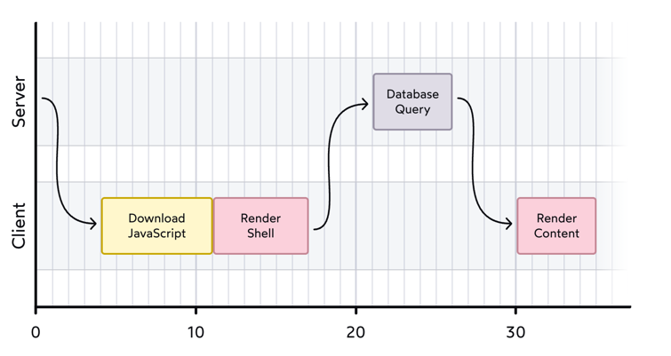
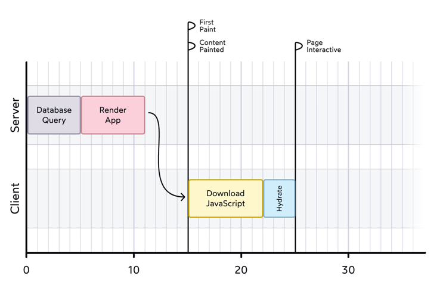
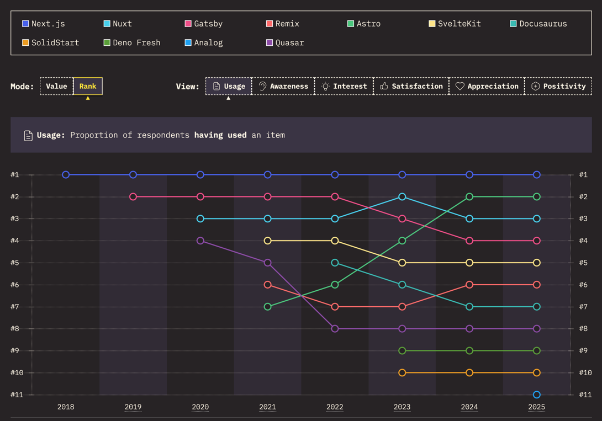
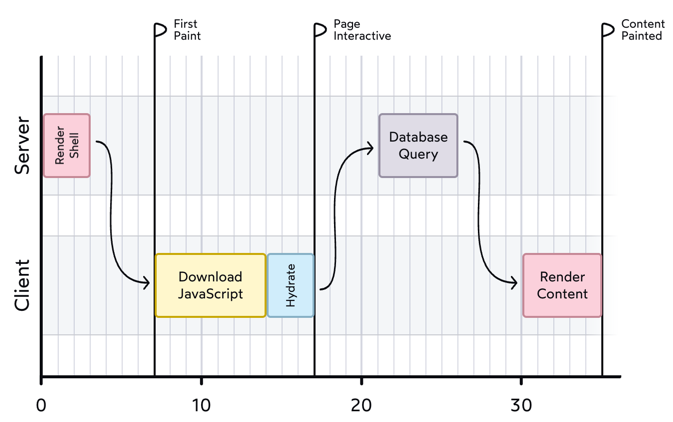
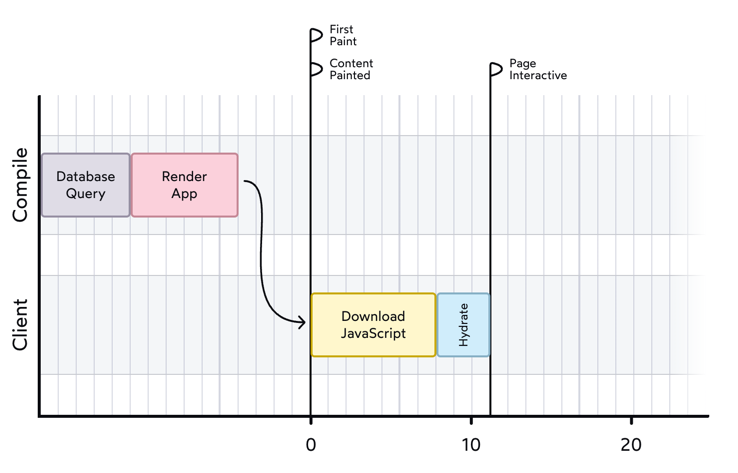
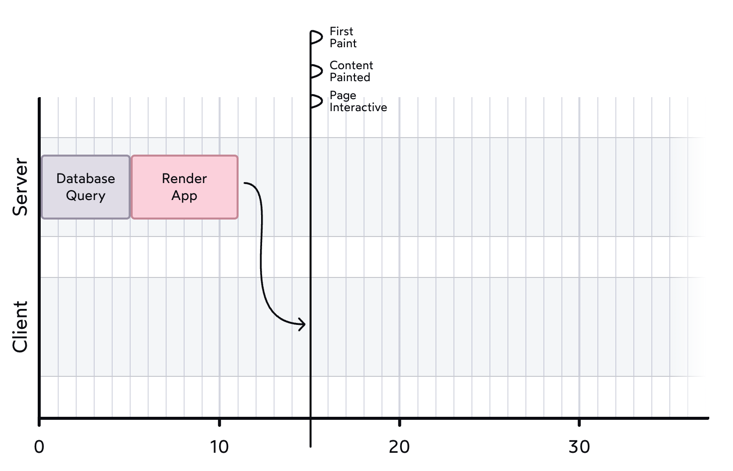

<br>

<h1 class="title-gradient"><span class="the-gradient">Frontend Frameworks</span>Frontend Frameworks 2026</h1>

---
layout: two-cols-header
layoutClass: gap-x-8
hideInToc: true
---

# Why do we have so many frontend frameworks?

::left::


::right::

- **React**
- **Vue**
- **Angular**
- **Svelte**
- **Preact**
- **Solid**
- **Lit**
- **Astro**
- **Qwik**

---
hideInToc: true
---

# Agenda

<Toc minDepth="1" maxDepth="1" />

---
hideInToc: true
---

# What a frontend framework consists of

- Change detection: `UI = func(state)`
- Router
- HTTP client
- Bundler + CLI
- Style manager
- State manager
- Others: From validator, asset manager, etc.

---
layout: intro
hideInToc: true
---

<h1 class="title-gradient"><span class="the-gradient">Change detection</span>Change detection</h1>

<div class="flex flex-wrap gap-x-2">

Covers

<span><logos-angular-icon /> Angular </span>

<span> <logos-react /> React</span>

<span><logos-vue /> Vue</span>

<span> <logos-svelte-icon /> Svelte </span>

<span><logos-solidjs-icon /> Solid</span>

<span> <logos-lit-icon /> Lit</span>

</div>

---

# Change detection

<v-click>

Vanilla JS and jQuery:

```js
on(EVENT) => manipulate DOM
```

</v-click>

<v-click>

Frameworks:

```js
UI = component(state);
```

</v-click>

<v-click>

Change detection strategies:

</v-click>

<v-clicks>

- Dirty checking
- Virtual DOM
- Fine-grained reactivity

</v-clicks>

---
hideInToc: true
---

# Changed detection strategies

<div class="flex gap-x-4 h-90%">


<v-click>


</v-click>

</div>

---
hideInToc: true
---

## Dirty checking

````md magic-move
```js
html`<div>
  <h1>Static content</h1>
  <p>${state}</p>
</div>`;
```

```js
html`<div>
  <h1>Static content</h1>
  <p>${state}</p>
</div>`;

function html(template, ...bindings) {
  if (initial render) {
    render template;
  }
}
```

```js
html`<div>
  <h1>Static content</h1>
  <p>${state}</p>
</div>`;

let prevBindings = [];
function html(template, ...bindings) {
  if (initial render) {
    render template;
  } else {
    return diff(prevBindings, bindings);
  }
}
```

```js
html`<div>
  <h1>Static content</h1>
  <p>${state}</p>
</div>`;

let prevBindings = [];
function html(template, ...bindings) {
  if (initial render) {
    render template;
  } else {
    return diff(prevBindings, bindings);
  }
}

function diff(prevBndings, newBindings)  {
  for (each binding) {
    update DOM if (prevBinding !== newBinding)
  }
}
```

```js
html`<div>
  <h1>Static content</h1>
  <p>${state}</p>
</div>`;

let prevBindings = [];
function html(template, ...bindings) {
  if (initial render) {
    render template;
  } else {
    return diff(prevBindings, bindings);
  }
}

function diff(prevBndings, newBindings)  {
  for (each binding) {
    update DOM if (prevBinding !== newBinding)
  }
  prevBindings = newBindings;
}
```
````

---
layout: two-cols-header
layoutClass: gap-x-8
hideInToc: true
---

## Virtual DOM

::left::

````md magic-move
```jsx
// JSX
<div>
  <h1>Static content</h1>
  <p>{state}</p>
</div>
```

```js
// virtual DOM
h(
  "div",

  h("h1", "Static content"),
  h("p", state),
);
```

```js
h(
  "div",

  h("h1", "Static content"),
  h("p", state),
);

// construct a virtual DOM tree
function h(type, args, children) {
  return { type, args, children };
}
```

```js
h("div", h("h1", "Static content"), h("p", state));

function h() {...}
```

```js
h("div", h("h1", "Static content"), h("p", state));

function h() {...}

function diff(oldH, newH) {
  if (oldH.type !== newH.type) {
    replace oldVNode with newVNode;
  } else if (attributes changed) {
    update attributes;
  } else {
    diff(oldH.children, newH.children);
  }
}
```
````

::right::


---
hideInToc: true
---

## Dirty checking vs Virtual DOM

**Dirty checking:**

- Native DOM APIs (No recreating the DOM in memory)
- Simpler to implement
- One pass to update the DOM
- Static content isn't checked

**Virtual DOM:**

- Works in other environments (e.g. React Native)
- Two passes to update the DOM (construct virtual DOM, then diff)
- Batch updates together

---
hideInToc: true
---

## <logos-svelte-icon /> Svelte v4: dirty checking at compile time

````md magic-move
```svelte
<script>
  let count = 0;
</script>

<h1>Static content</h1>
<p>{count}</p>
<button on:click={() => count++}>+</button>
```

```js {*|2-9|10-14}
function mount(target) {
  target.innerHTML = `<h1>Static content</h1>`;

  const p = document.createElement("p");
  p.textContent = count;

  const btn = document.createElement("button");
  btn.textContent = "+";
  target.append(h1, p, btn);

  btn.addEventListener("click", () => {
    count++;
    update(1);
  });
}
```

```js {17-19|*}
function mount(target) {
  target.innerHTML = `<h1>Static content</h1>`;

  const p = document.createElement("p");
  p.textContent = count;

  const btn = document.createElement("button");
  btn.textContent = "+";
  target.append(h1, p, btn);

  btn.addEventListener("click", () => {
    count++;
    update(count);
  });
}

function update(count) {
  p.textContent = count;
}
```
````

---
hideInToc: true
---

## How do frameworks know state changed?

<v-clicks>

- Monkey-patching every API. Zone.js -> Angular
- `setState` -> React
- Compile-time analysis -> Svelte

</v-clicks>

<!--
- Without zone.js, Angular wouldn't know when state is changed. Mutation is detected by Angular
-->

---
hideInToc: true
---

# Change detection strategies

<div class="flex h-90%">


</div>

<!--
Before explaining signals: signals are primitives and there's no change-detection system. Signals themselves are reactive.
-->

---
hideInToc: true
---

# Fine-grained reactivity (signals)

````md magic-move
```jsx
function Parent() {
  const [count, setCount] = createSignal(0);
  console.log("Parent rendered"); // logs ONCE on mount

  return (
    <h2>Counter</h2>
    <button onClick={() => setCount(count() + 1)}>+</button>
    <span>{count()}</span>
  );
}
```

```jsx
function Parent() {
  const [count, setCount] = createSignal(0);
  console.log("Parent rendered");

  return (
    <h2>Counter</h2>
    <button onClick={() => setCount(count() + 1)}>+</button>
    <Child count={count} />
  );
}

function Child(props) {
  console.log("Child rendered"); // logs ONCE on mount
  return (
    <h3>Current value</h3>
    <p>The count is: {props.count()}</p>
  );
}
```
````

---
layout: two-cols-header
layoutClass: gap-x-8
hideInToc: true
---

# Signals are becoming more popular

::left::

- Solid is built on signals
- Angular added signals, introduced zone-less
- Preact added signals
- Vue added signals in Vue Vapor
- Svelte added signals
- JavaScript: signals spec in stage 1

::right::

<v-click>

| Framework                      | Change detection                  |
| ------------------------------ | --------------------------------- |
| <logos-react /> React          | Virtual DOM                       |
| <logos-preact /> Preact        | Virtual DOM + Signals             |
| <logos-angular-icon /> Angular | Signals (zoneless)                |
| <logos-vue /> Vue              | Virtual DOM + Signals (Vue Vapor) |
| <logos-svelte-icon /> Svelte   | Compile-time Signals              |
| <logos-solidjs-icon /> Solid   | Signals                           |

</v-click>

<!--
- Angular started with Angular.js and action script then switch to Dart then TS. catching up on TypeScript and signals is impressive.
- React proxies events `SyntheticEvent` because browsers had different APIs. Preact removed them.
- `SyntheticEvent` is why some APIs aren't supported in React.
-->

---

<div class="flex h-100%">


</div>

---
layout: two-cols-header
layoutClass: gap-x-8
hideInToc: true
---

# Framework? Library? Vite?

::left::

<v-clicks>

- Full framework: <span class="text-red">Angular</span>,
  <span class="text-green">Vue</span>, <span class="text-orange">Svelte
  (SvelteKit)</span> , <span class="text-sky">Solid (SolidStart)</span> with
  built-in router, data fetching, ssr, etc.

- <span class="text-blue">React</span>: need external libraries for routing,
  data fetching, ssr, etc. (<span class="text-cyan">React Router</span>,
  <span class="text-gray">Tanstack Query</span>,
  <span class="text-slate">Next.js</span>)

- <span class="text-purple">Vite</span> is a bundler. All frameworks use Vite
  except Next.js (Turbopack)

</v-clicks>

::right::

<v-click at="1">


</v-click>

<v-click at="2">


</v-click>

<v-click at="3">


</v-click>

<!--
It's worth mentioning that React by itself isn't a full framework. For routing, data fetching, state management, styling, etc. you need external libraries.
Angular is battery-included. Vue is somewhere in between. Svelte and Solid have SvelteKit and SolidStart.
-->

---
hideInToc: true
---

# <logos-lit-icon /> Lit: Web components

```html
<simple-greeting name="World"></simple-greeting>
```

```js
@customElement("simple-greeting")
export class SimpleGreeting extends LitElement {
  static styles = css`
    p {
      color: blue;
    }
  `;

  @property()
  name = "Somebody";

  render() {
    return html`<p>Hello, ${this.name}!</p>`;
  }
}
```

<!--
Lit is a very simple framework for building web components. It uses dirty checking.
-->

---
layout: intro
---

<h1 class="title-gradient"><span class="the-gradient">Rendering strategies</span>Rendering strategies</h1>

<div class="flex flex-wrap gap-x-4">

Covers

<span><logos-react /> React Server Components </span>

<span> <logos-nextjs-icon /> Next.js</span>

<span><span class="astro"><logos-astro-icon /></span> Astro</span>

<span> <logos-qwik-icon /> Qwik </span>

</div>

<style>
.astro {
  background: #fff;
  padding: 4px 4px 0;
border-radius: 10px;
}
</style>

---
layout: two-cols-header
layoutClass: gap-x-8
---

# Server side rendering (SSR)

Run the bundle in server, get the html, send html and bundle to client, hydrate

::left::

Client side rendering (CSR)



::right::

Server side rendering (SSR)



<span v-click class="abs-html">
HTML
</span>

<style>
.abs-html {
  position: absolute;
    top: 72%;
    left: 71.7%;
    transform: translate(-50%, -50%);
    font-size: 12px;
    font-weight: bold;
    color: #5f2b00;
    background: #ff99008a;
    padding: 2px 4px;
}
</style>

---



<!--
Problem is when your site has mostly static content (like blogs), sending the
bundle again and running it twice (server and client) isn't efficient.

Solutions:
-->

---
layout: two-cols-header
layoutClass: gap-x-8
hideInToc: true
---

# SSR, SSG, RSC

::left::

````md magic-move
```tsx
// Runs on server + client:
export default function Page() {
  const data = fetch("/api/data");
  function submit() { post("/api/submit") }

  return (
    <div>{data}</div>
    <button onClick={submit()}>Submit</button>
  );
}
```

```tsx
// ----- SSR -----
// Runs on server:
export async function getServerSideProps() {
  const data = await db.connect().query();
  return data;
}

// Runs on server + client
export default function Page({ data }) {
  function submit() { post("/api/submit") }

  return (
    <div>{data}</div>
    <button onClick={submit()}>Submit</button>
  );
}
```

```tsx
// ----- SSG -----
// Runs on build:
export async function getStaticData() {
  const data = await loadDataFromFileSystem();
  return data;
}

// Runs on build + client
export default function Page({ data }) {
  function submit() { post("/api/submit") }

  return (
    <div>{data}</div>
    <button onClick={submit()}>Submit</button>
  );
}
```

```tsx
// ----- RSC -----
// Runs on server:
export default function Page({ data }) {
  const data = await db.connect().query();
  function submit() { post("/api/submit") }

  return (
    <div>{data}</div>
    <button onClick={submit()}>Submit</button>
  );
}
```
````

::right::

<div v-click.hide="1">



</div>

<div v-click="[1,2]">


</div>

<div v-click="[2,3]">



</div>

<div v-click="[3,4]">



</div>

<style>
.slidev-vclick-hidden {
display: none !important;
}
</style>

---
hideInToc: true
---

# Astro: Islands architecture

````md magic-move
```astro
---
// Runs on server / build
const products = await db.products.findAll();
---

<body>
  <ul>
    {products.map((p) => <li>{p.name}</li>)}
  </ul>
</body>
```

```astro
---
// Runs on server / build
const products = await db.products.findAll();
---

<body>
  <ul>
    {products.map((p) => <li>{p.name}</li>)}
  </ul>

  <!-- Island: run on server + client -->
  <Counter client />
</body>
```

```astro
---
// Runs on server / build
const products = await db.products.findAll();
---

<body>
  <Ad client:idle /> <!-- when browser is idle -->
  <ul>
    {products.map((p) => <li>{p.name}</li>)}
  </ul>

  <Counter client:load /> <!-- on page load -->

  <footer>
    <div>static footer</div>
    <InterativeFooter client:visible /> <!-- when visible on screen -->
  </footer>
</body>
```

```astro
---
// Runs on server / build
const products = await db.products.findAll();
---

<body>
  <PreactAd client:idle /> <!-- Preact -->
  <ul>
    {products.map((p) => <li>{p.name}</li>)}
  </ul>

  <SolidCounter client:load /> <!-- Solid -->

  <footer>
    <div>static footer</div>
    <VueFooter client:visible /> <!-- Vue -->
  </footer>
</body>
```
````

<!--
Astro ships only the JS for the interative bits. Great for content-heavy sites.

- Islands use any framework (React, Vue, Svelte, Solid, Lit) — you pick per
  island.
- `client:load` / `client:idle` / `client:visible` / `client:media` /
  `client:only` control **when** each island hydrates.
- Each island is its own independent bundle — no global JS shell.
-->

---
hideInToc: true
---

# Qwik: Resumability

````md magic-move
```tsx
import { component$, useSignal } from "@qwik.dev/core";

export const Counter = component$(() => {
  const count = useSignal(0);

  return (
    <div>
      <p>Count: {count.value}</p>
      <button onClick$={() => count.value++}>+</button>
    </div>
  );
});
```

```html
<!-- What the browser actually receives -->
<div>
  <p>Count: 0</p>
  <button q:id="42" on:click="./chunks/abc.js#Counter_onClick">+</button>
</div>
```
````

<div v-click="2">

- **No hydration step.** The server already ran everything; the client doesn't
  replay it.
- The `$` suffix is a **compiler boundary**. Qwik splits the code at every `$` into its own chunk.
- Event handlers are downloaded **lazily, on first interaction**

</div>

<!--
The server serializes the entire app — including which handlers
are attached to which DOM nodes — into the HTML. The client just resumes.

Hydration = "replay everything on the client to attach listeners and rebuild state".
Resumability = "server hands the client a paused snapshot of the app; resume from there".
-->

---

# Wrap up

<v-clicks>

- Check out https://2025.stateofjs.com/
- Everyone's converging on signals
- Vite has won the bundler war
- Hydration is on the way out

Practical takeaway (personal opinion)

- Mostly static content (marketing, docs, blogs) → Astro
- Highly interactive app, want maximum perf → Signals (Solid, Svelte, Preact + signals)

</v-clicks>
