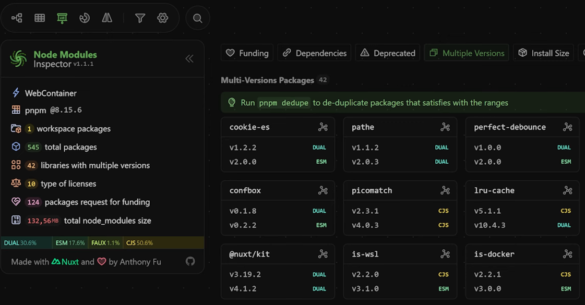
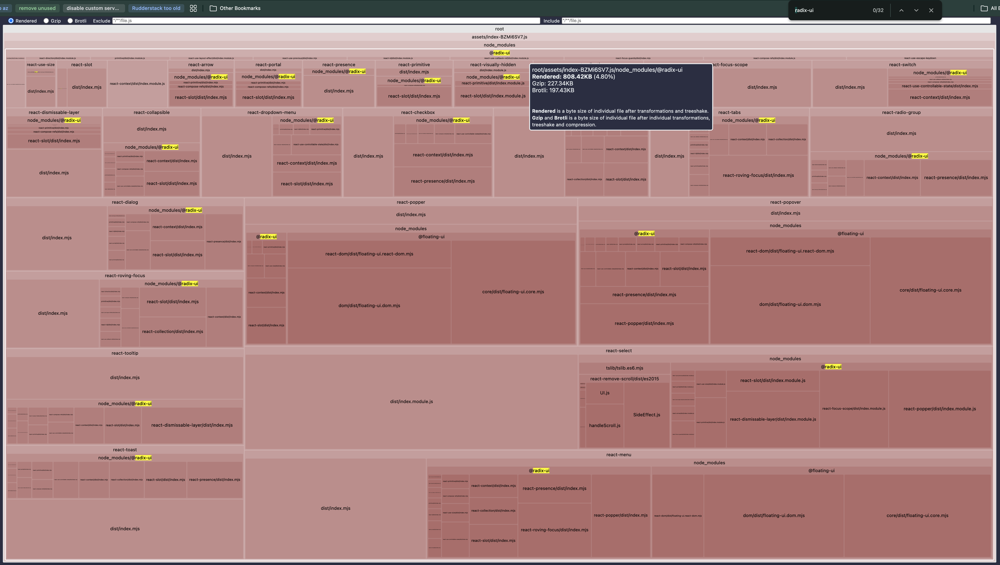
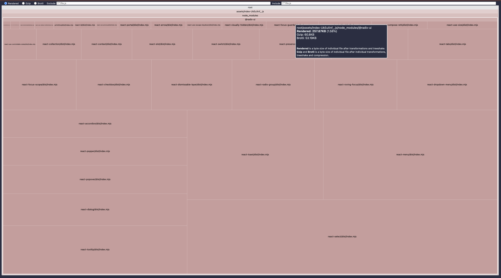

# Package Dependencies & Bundling

---
hideInToc: true
---

# Agenda

<Toc minDepth="1" maxDepth="2" />

---
layout: two-cols-header
layoutClass: gap-8
---

# How NPM Installs Dependencies

::left::

[How NPM v3+ works](https://npm.github.io/how-npm-works-docs/npm3/how-npm3-works.html)

> dependency resolution depends on install order

Example:

1. Install A-v1
2. Install B-v1
3. Update to A-v2
4. Update to B-v2
5. `npm dedupe`

::right::

````md magic-move
```sh
A-v1 --> Dep-v1
B-v1 --> Dep-v1
A-v2 --> Dep-v2
B-v2 --> Dep-v2
```

```sh
A-v1 --> Dep-v1
B-v1 --> Dep-v1
A-v2 --> Dep-v2
B-v2 --> Dep-v2

node_modules/
├── A/ (v1)
└── dep/ (v1) # Hoisted
```

```sh
A-v1 --> Dep-v1
B-v1 --> Dep-v1
A-v2 --> Dep-v2
B-v2 --> Dep-v2

node_modules/
├── A/ (v1)
├── B/ (v1)
└── dep/ (v1) # Hoisted
```

```sh
A-v1 --> Dep-v1
B-v1 --> Dep-v1
A-v2 --> Dep-v2
B-v2 --> Dep-v2

node_modules/
├── A/ (v2)
│   └── node_modules/
│       └── dep/ (v2)
├── B/ (v1)
└── dep/ (v1) # Hoisted
```

```sh
A-v1 --> Dep-v1
B-v1 --> Dep-v1
A-v2 --> Dep-v2
B-v2 --> Dep-v2

node_modules/
├── A/ (v2)
│   └── node_modules/
│       └── dep/ (v2)
└── B/ (v2)
    └── node_modules/
        └── dep/ (v2)
```

```sh
A-v1 --> Dep-v1
B-v1 --> Dep-v1
A-v2 --> Dep-v2
B-v2 --> Dep-v2

node_modules/
├── A/ (v2)
├── B/ (v2)
└── dep/ (v2) # Hoisted
```
````

---

## How to find duplicated dependencies

- `npm find-dupes`: shows all duplicated packages
- `npm ls <package>`: shows dependency tree for a package Examples:
  - `npm ls downshift`: deduped
  - `npm ls es-toolit`: duplicated
- `npx node-modules-inspector`: Node modules inspector shows a visual tree of
  dependencies and duplicates



---

### Example in Design System

````md magic-move
```json
{
  "name": "@accurx/design",
  "dependencies": {
    "@radix-ui/react-accordion": "^1.1.0",
    "@radix-ui/react-button": "^1.0.1",
    "@radix-ui/react-dialog": "^1.2.0"
  }
}
```

```json
{
  "name": "@accurx/design",
  "dependencies": {
    "radix-ui": "^1.2.0"
  }
}
```
````

<v-switch>
<template #1></template>
<template #2></template>
</v-switch>

---
layout: intro
---

# dependencies vs peerDependencies

---

## NPM Dependency Types for libraries

- **dependencies**: you **don't** expect consumers to have these. npm installs
  them if missing.
- **peerDependencies**: you expect consumers to have these. npm installs them if
  missing.
  - npm warn/error on version conflicts.
  - > For example, `^v1.0.0` and `^v2.0.0` are non-overlapping ranges.
- **devDependencies**: dev-time only, not shipped to consumers.
  - Without peers in devDependencies, you can't run tests or dev server.
  - In non-library projects, devDependencies behave like dependencies.
- **peerDependenciesMeta**: mark peers as optional. npm won't install them if
  missing.

<v-click>

- **optionalDependencies**: like dependencies, but install failures are ignored.
  - Can be omitted by `npm install --no-optional`
  - For example `playwright` is optional. This can speed up CI installs for
    build.

</v-click>

<style>
strong {
  color: #ffc870;
}
</style>

---

### Example

````md magic-move
```json
{
  "name": "@accurx/design",
  "exports": { ".": "./dist/index.js" } # import {} from '@accurx/design'
}
```

```json
{
  "name": "@accurx/design",
  "exports": { ".": "./dist/index.js" },
  "dependencies": {
    "radix-ui": "^1.0.0" # We don't expect consumers to install this
  }
}
```

```json
{
  "name": "@accurx/design",
  "exports": { ".": "./dist/index.js" },
  "dependencies": {
    "radix-ui": "^1.0.0"
  },
  "peerDependencies": {
    "react": "^18.0.0 | ^19.0.0" # We expect consumers to have React
  }
}
```

```json
{
  "name": "@accurx/design",
  "exports": { ".": "./dist/index.js" },
  "dependencies": {
    "radix-ui": "^1.0.0"
  },
  "peerDependencies": {
    "react": "^18.0.0 | ^19.0.0"
  },
  "devDependencies": {
    "react": "^19.0.0" # For local development/testing
  }
}
```

```json
{
  "name": "@accurx/design",
  "exports": { ".": "./dist/index.js" },
  "dependencies": {
    "radix-ui": "^1.0.0"
  },
  "peerDependencies": {
    "react": "^18.0.0 | ^19.0.0",
    "react-router": "^6.0.0" # One component uses this
  },
  "devDependencies": {
    "react": "^19.0.0"
  }
}
```

```json
{
  "name": "@accurx/design",
  "exports": { ".": "./dist/index.js" },
  "dependencies": {
    "radix-ui": "^1.0.0"
  },
  "peerDependencies": {
    "react": "^18.0.0 | ^19.0.0",
    "react-router": "^6.0.0" # One component uses this
  },
  "peerDependenciesMeta": {
    "react-router": { "optional": true } # Not all consumers use that component
  },
  "devDependencies": {
    "react": "^19.0.0"
  }
}
```

```json
{
  "name": "@accurx/design",
  "exports": {
    ".": "./dist/index.js",
    "./router": "./dist/router.js"   # import {} from '@accurx/design/router'
  },
  "dependencies": {
    "radix-ui": "^1.0.0"
  },
  "peerDependencies": {
    "react": "^18.0.0 | ^19.0.0",
    "react-router": "^6.0.0"
  },
  "peerDependenciesMeta": {
    "react-router": { "optional": true }
  },
  "devDependencies": {
    "react": "^19.0.0"
  }
}
```
````

---
layout: intro
---

# To Bundle or Not to Bundle

Making the right decision for your dependencies

---

## What is pre-bundling / inlining / etc?

[e18e.dev article on bundling dependencies](https://e18e.dev/blog/bundling-dependencies)

- <span class="text-yellow">**inline** a dependency:</span> take the source of
  it and copy it into our codebase
- <span class="text-yellow">**pre-bundle** a dependency:</span> (or just
  "bundle"): build library with a bundler like vite before publishing it.

In both cases, the dependency is no longer taken from npm and is instead stored
in our published package output as if we wrote it ourselves (and are "dependency
free").

---

### What happens when consumers install your package?

````md magic-move
```sh
node_modules/
└── your-package/
    └── dist
        └── index.js
```

```sh {3-4|7}
node_modules/
├── your-package/
│   ├── node_modules/
│   │   └── dep-a@1/    # dependencies that don't match consumer's versions
│   └── dist
│       └── index.js
└── dep-a@2/            # consumer's own dep-a (unmatched version)
```

```sh {6-7|3-4|*}
node_modules/
├── your-package/
│   ├── node_modules/
│   │   └── dep-a@1/    # Not bundled, installed by npm as normal
│   └── dist
│       ├── node_modules/
│       │   └── dep-b/  # bundled dep-b
│       └── index.js
└── dep-a@2/
```

```sh
node_modules/
├── your-package/
│   └── dist
│       ├── node_modules/
│       │   └── dep-b@1/  # Same version but bundled (not managed by npm)
│       └── index.js
└── dep-b@1/
```
````

---

## When to Bundle? (almost never!)

Bundle (include in your dist):

- Using only a small part of a large dependency
- Dependency is CommonJS and you're targeting browsers
  - Because browsers can't load CommonJS
  - If this is the case, ideally you would either move away from the package to
    an ESM alternative

<v-click>

### Avoid bundling in vite:

```js
import { builtinModules } from "module";
import packageJson from "./package.json" with { type: "json" };

export default defineConfig({
  build: {
    rollupOptions: {
      external: [
        ...Object.keys(packageJson.peerDependencies || {}),
        ...Object.keys(packageJson.dependencies || {}),
        ...builtinModules,
        ...builtinModules.map((m) => `node:${m}`),
      ].map((dep) => new RegExp(`^${dep}(/.*)?$`)), // Regex to match the package and its sub-paths
    },
  },
});
```

</v-click>

---

# Summary

- Use **peerDependencies** for libraries when you expect consumers to have them
  to avoid duplicates.
- Avoid bundling dependencies unless absolutely necessary.
- Use `npm dedupe` and `node-modules-inspector` to resolve duplicate
  dependencies and more.
