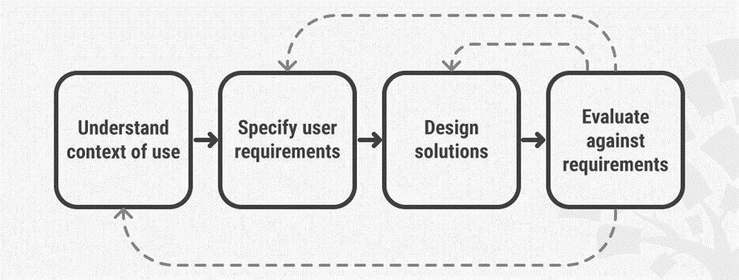
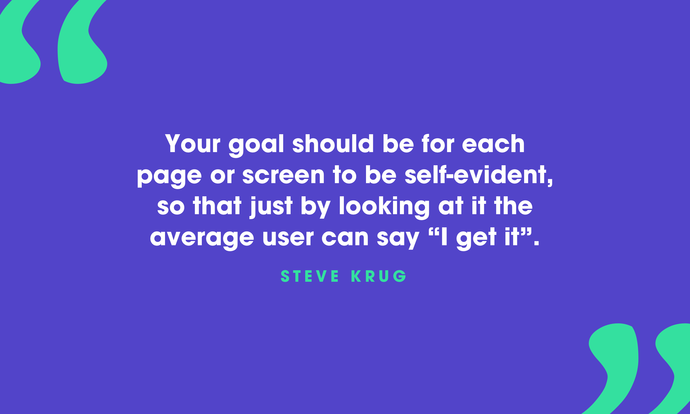
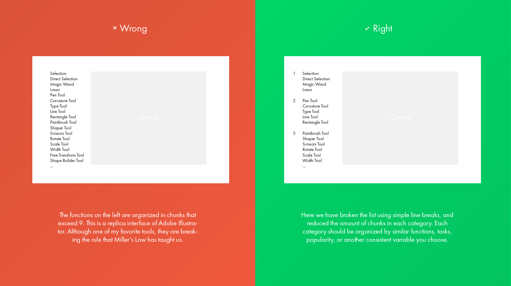
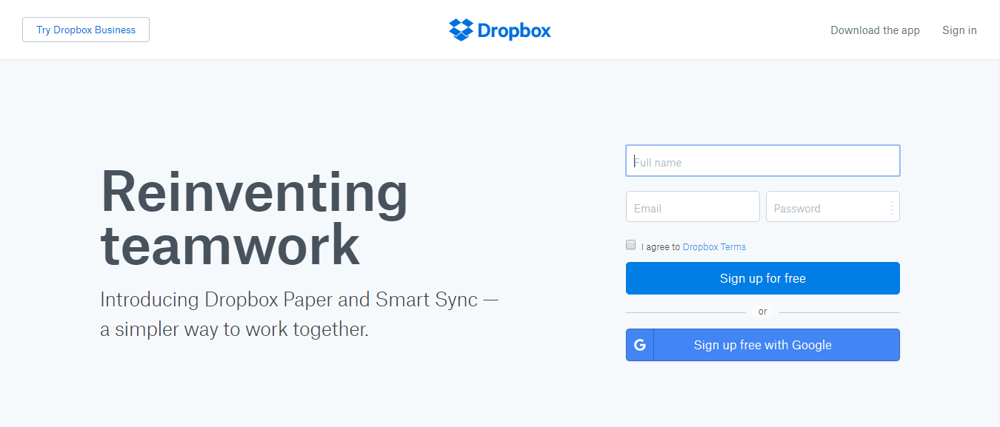
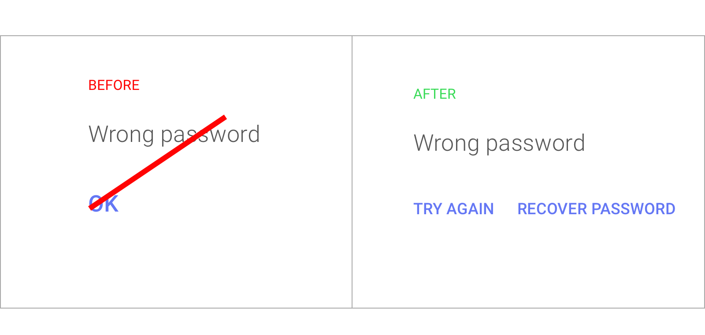
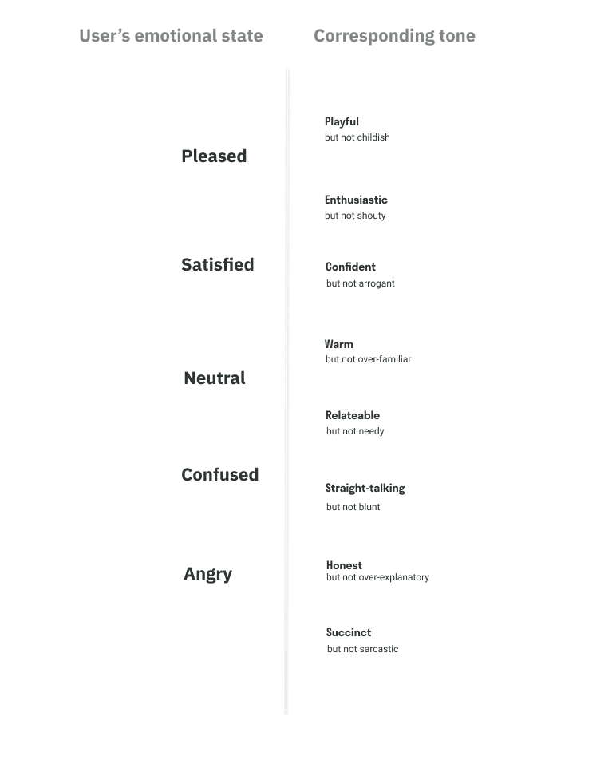
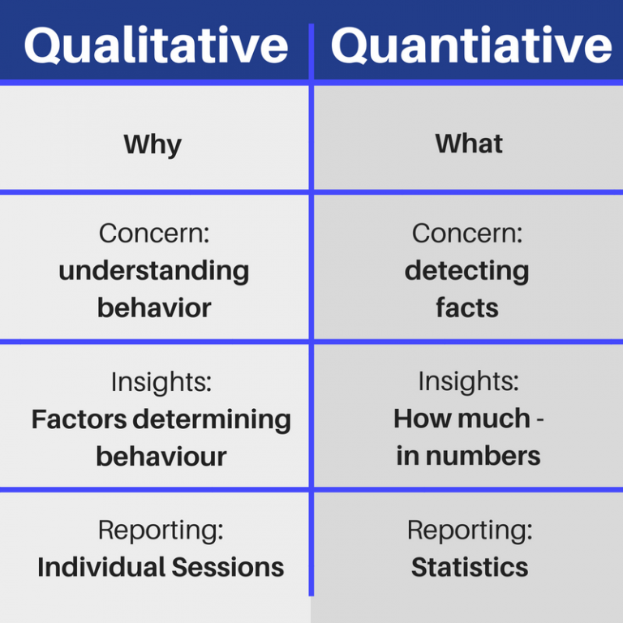
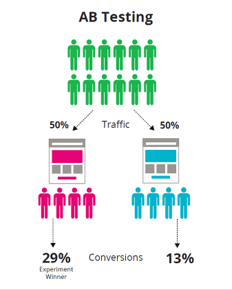
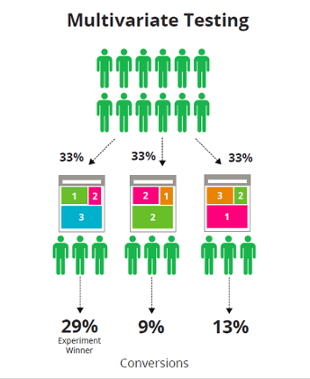
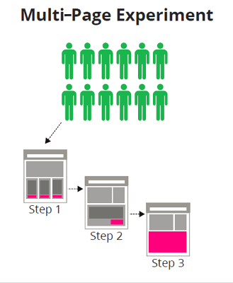

class: center, middle

# User Experience Design

_By: Vahid Mohammadi_

---

class: center, middle

# What is UX

---

class: center, middle

# UX Research

---

## The Business Value of User Research

It essentially means the difference between getting it right from the start or having to go back and fix your mistakes.

### Field study

- exactly how users do something and why so
- user needs and discover opportunities for their satisfaction

### In-depth interview

- user scenarios
- user goals, tasks and problems
- motivation to use products

### Diary study

- patterns and scenarios of interaction with the product

---

### Card Sorting

### Eye tracking

- where the user’s eye has focused
- the sequence of passing through the various elements
- zones in which a person doesn’t look at all

---

class: center, middle

# UX Design

---

class: full-page-image

???
A user interface is like a joke. if you have to explain it, it's not that good.

---

## Some Important Rules

<a href="https://uxplanet.org/51-research-terms-you-need-to-know-as-a-ux-designer-fac0d40a59d7">Research terms you need to know</a>

    <a href="https://medium.com/predict/good-design-rules-in-ux-design-5b77497cdb5b">Miller's Law</a>
    <a href="https://en.wikipedia.org/wiki/Three-click_rule">3 Clicks Rule</a>
    <a href="https://articles.uie.com/five_second_test/">5 Second Test</a>
    <a href="https://en.wikipedia.org/wiki/Pareto_principle">80/20 Rule</a>
    <a href="https://en.wikipedia.org/wiki/Web_accessibility">Accessiblility</a>

---

### Create Effective Visual Hierarchies

- The more important something is, the prominent it is
- Things that are related logically, are related visually

--

### Don’t reinvent the wheel

--

### We do not care how your product works

--

### We are in a hurry!

---

## We don't read, we scan

- Use plenty of headings
- Keep paragraphs short
- Use bulleted lists
- Highlight key terms

---

## Visual Cues

    <a href="https://uxplanet.org/common-webpage-design-mistakes-59eed9831bd7">Common Design Mistakes</a>

- Contrast
- Sizing
- Spacing
- Placement
- Flow
- Colors
- Shape
- Backgrounds
- Borders
- Shadows

---

## Negative Space (White Space)

    <a href="https://uxplanet.org/the-power-of-whitespace-a1a95e45f82b">Negative Space</a>

---

### Improving Comprehension

---

### Clarifying Relationships

---

### Attracting Attention

---

## UX Writing

    <a href="https://uxplanet.org/ux-writing-how-to-do-it-like-google-with-this-powerful-checklist-e263cc37f5f1">UX Writing</a>

- Writing Principles
- Brand Voice

---

## Writing Principles

### Clear

---

### Concise

---

### Useful

---

## Brand Voice

  
  

  <ul>
    <li>
      What is the user’s goal?
    </li>
  <li>
    What might they be feeling in that moment?
  </li>
  <li>
    What would you like them to feel?
  </li>
  </ul>

  
  

---

### Tone Spectrum

  

---

class: center, middle

# UX Analytics

---

class: full-page-image

---

## UX Research Methods

--

### Face to face interview

--

### User Surveys

- In app or in webiste

- Email Surveys
- Live Chat Button
- Social Media Listening

---

### Usability Tests

- Heatmaps

- Split Testing

---

## Split Testing

> a way of comparing multiple versions of a Web page or Web pages to find out which one converts the best.

- Choosing Your Goals
- Duration of Test
- Segmenting Your Users
- Integrating with Analytics

## Types of Split Testing

- Before/After Testing
- A/B Testing
- Multivariate Testing
- Multi-page Testing

---

### A/B Testing

> By tracking the way visitors interact with the page they’re shown and subsequent pages they visit, you can determine which version of the page is most effective.

---

### Multivariate Testing

---

### Multi-page Testing

---

class: center, middle

# Conculsion

